# UX Design Specification — Magus Warrior

**Author:** John Riston
**Date:** 2026-05-08

---

<!-- UX design content will be appended sequentially through collaborative workflow steps -->

## Executive Summary

### Project Vision

Magus Warrior is a faithful solo mobile adaptation of Mage Knight Ultimate Edition for
Android (Godot 4 + C#). One hero (Thomas), one scenario (First Reconnaissance, 4 rounds),
card-driven tactical adventure on a procedurally placed hex map. The game targets MK fans
who want the authentic feel of the physical game in a phone-native, 5-minute-session format.

The primary design pillar is **Faithful Feel** — every UX decision should serve the feeling
of playing physical Mage Knight, not the feeling of playing a generic mobile game.

### Target Users

**Primary:** Mage Knight veterans (10+ plays of the physical game). They know the rules,
they know the card taxonomy, they know the phase structure. They are frustrated by the
physical game's setup time and space requirements. They want speed and fidelity.

**Secondary:** MK-curious players (own the game, played 1–5 times). They understand the
concept but are still internalising the rules. They need contextual help to bridge from
"I know what a Spell card is" to "I know which phases it's legal to play one."

**Design implication:** The UI must work for both. Context-sensitive help is a first-class
feature. A veteran toggle to disable it is equally first-class. Help cannot be the kind
of thing you bolt on later — it must be a designed layout zone from day one. The veteran
toggle governs both help text visibility and decision pacing — veterans move at their own
speed; curious players may benefit from a more guided, sequenced rhythm.

Both audiences need the same information. The difference is not *what* they need — it's
*how fast* they can parse it. Veterans are scanning; curious players are reading. The
design goal is **legibility at both speeds** on the same data.

**Device context:** Landscape-only on a mid-tier Android phone (Samsung Galaxy S21 as
baseline). Sessions as short as 5 minutes; game must re-orient cleanly on every resume.
Touch-only (tap, pinch, long-press). No stylus assumption.

### Key Design Challenges

**1. No prior screen contract (root cause of previous attempt failure)**
The previous implementation suffered from features placed without defined layout zones —
overlapping UI, unclear ownership, and components that couldn't be tested in isolation.
The UX LLD must solve this by defining an explicit screen contract: named layout zones,
rules about what can coexist, and clear layering/z-order semantics. Every feature gets
placed against this contract, not against gut feel.

**2. Combat legibility: scanability vs. readability on the same screen**
Four sequential combat phases (Ranged/Siege → Block → Assign Damage → Attack). During
each phase, the player must simultaneously track: current phase, hand contents, running
attack/block totals, enemy stats and resistances, unit states, and available mana.
The challenge is not reducing this information — both audiences need it all. The
challenge is **legibility**: veterans must be able to scan for the number they need;
curious players must be able to read the label they don't yet know. Type hierarchy,
icon-vs-text choices, and label verbosity are the design levers, not information hiding.
Key stats (attack total, block total, current phase) must be always-visible in the HUD
— never tucked behind an interaction.

**3. Phase legality communication — two distinct help layers**
The player must know *immediately* what's legal right now. Silent rejection teaches
nothing. The legality system must provide two distinct help layers:
- **Card-level:** "Why is this card unavailable right now?" (wrong phase, insufficient
  mana, wound) — triggered by tapping an unavailable card
- **Phase-level:** "What should I be doing this phase?" — ambient guidance for curious
  players, dismissible by veterans
Both layers must educate without interrupting flow.

**4. Mana state complexity — Day/Night restriction as a learning challenge**
Simultaneously live: dice selections, crystal tokens, Day/Night source restrictions,
exhausted source dice, and the running mana total. The Day/Night restriction (Gold
restricted to Day, Black restricted to Night) is a specific learning pain point — it
is unintuitive for new players and easy to misremember. The mana zone must make
currently-selectable sources *unmistakably obvious*, not merely present — players
should never need to reason through which dice are available.

**5. Hand layout and expand surface (contract prerequisite)**
The hand scroll direction and card expand surface must be decided before any gesture
work can begin. This is a prerequisite contract decision, not a UX question. Hand
layout: 7 cards visible by default in landscape; at 8+ cards the hand scrolls
horizontally, with the 8th card partially clipped + fade gradient + › indicator to
signal more. Scroll is acceptable and expected — real play regularly produces 11+
card hands (Tactics bonuses, Planning tactic, Great Start). The design goal is
discoverability, not simultaneity: the clipped edge makes clear that more cards
exist; one swipe reaches them. The contract must specify: hand layout format, expand
trigger, expand surface bounds, and what happens to the rest of the hand while a
card is expanded.

**6. Testability per epic**
UX components must be testable in isolation per epic. This requires each layout zone
to have an **isolated state harness**: a defined set of state inputs and expected
render outputs that can be verified without running the full game loop. The UX LLD
must specify zone boundaries and state inputs explicitly — without this, the
architecture cannot implement the harness, and integration testing becomes the
only verification path.

### Design Opportunities

**1. Cognitive rhythm preservation**
Physical Mage Knight has a specific decision beat: assess hand → pick card → read it
→ decide → commit. That rhythm *is* the faithful feel — not the visual layout of the
physical card, not the spatial arrangement of the table. A mobile design that
preserves this beat will feel faithful even if it looks nothing like the physical game.

Two moments in this beat demand explicit design attention:
- The **decide** moment: the player needs to feel in control, unhurried, with full
  information available before committing
- The **commit** moment: playing a card must feel final and satisfying — a snap, not
  a form submission. This is as important as the decision itself.

For curious players, this rhythm may benefit from sequenced guidance — directing
attention through the beat rather than presenting everything simultaneously. The
veteran toggle governs both help visibility and this pacing.

**2. Physical game muscle memory as an asset**
MK veterans have physical intuitions: pick up a card, read it, decide, place it. The
tap-to-expand model mirrors this gesture. Lean into it — the UX should feel like a
digital extension of the physical game's rhythm.

**3. Phase gating as a legibility engine — filter play, not vision**
The game's phase structure is a natural filter for *playability*, not *visibility*.
During Movement, combat cards cannot be played — but they must still be visible,
because veterans are planning across phases. The phase system reduces what the player
can *do*, not what they can *see*. The UX job is to make the current phase
unmistakably clear and let the phase-legality rendering (greyed/red states) do the
filtering work — without hiding the full hand from view.

**4. Interruption-first as a differentiator**
Mobile games that nail session resume become daily habits. A "exactly where you left
off, immediately re-oriented" experience is a meaningful differentiator for a game
this complex. This should be treated as a core feature, not a save-system detail.

**5. Help system as teaching, not blocking**
The inline context-sensitive help is an opportunity to turn the secondary audience
(curious newcomers) into veterans over time. The help system should answer the two
questions players actually ask: "why can't I do this?" and "what should I do now?"
— not provide generic card-text glossaries. Situational, triggered by player action,
dismissible permanently as mastery grows.

---

## Core User Experience

### Defining Experience

The heartbeat of Magus Warrior is the **card play loop**:

> assess hand → select card → expand → **reconsider?** (back returns to
> hand-assess with full hand visible — no reopen cost) → decide
> (Play / Play Sideways / Power / Cancel) → play gesture (satisfying
> snap, still reversible) → undo gate event (if triggered)

The reconsideration beat is explicit and first-class. In physical Mage Knight,
players frequently expand a card, think "wait no," and scan the hand again before
deciding. Back navigation from the expanded card view must land cleanly in
hand-assess mode with the full hand visible, scrolled to the same position. A hard
dismiss/reopen cycle is not acceptable — it adds friction that does not exist in
the physical game.

Everything else — map navigation, site entry, mana selection, unit management —
either serves this loop or gates access to it.

**Undo and the play gesture are distinct events.** Playing a card stages it and
should feel satisfying and deliberate — a physical snap, not a form submission. The
card remains reversible. The undo gate is triggered separately by information reveal
events: card drawn, tile flipped, enemy drawn, die rolled, card revealed in offer replenishment, face-down enemy revealed.

- The **play gesture** gets a visual snap — the card moves, the HUD updates
- The **undo gate event** gets a distinct signal — the undo affordance visibly
  changes state so the player knows the window has closed

**Undo animation:** Undo plays as the action in reverse with an ~80ms ease-in at
the start of the reversal. The ease-in signals intentionality ("the game heard you,
it's walking it back"). Without it, undo reads as error correction. With it, it
reads as a rewind.

**Undo de-emphasis in committed states:** When the player has staged multiple cards
and resolution appears imminent (3+ cards played, or enemy resolution in progress),
the undo affordance shifts to a receded state — ~55% opacity, border softens from
solid to dashed, scale reduces ~10%. Still tappable. Not hidden. The visual contrast
between full-weight undo (free to reconsider) and receded undo (world is moving)
teaches intentionality without explanation.

### Platform Strategy

| Dimension | Decision |
|---|---|
| Platform | Android only (v1); landscape-only |
| Input | Touch: tap, pinch-to-zoom+pan, long-press |
| Baseline device | Samsung Galaxy S21 (Snapdragon 888, 6GB RAM, Android 12) |
| Offline | Fully required — cloud save is opportunistic, never blocking |
| Session length | 5 minutes to 2 hours; both are valid; game re-orients on every resume |
| Gestures v1 | Tap (select/play), pinch (map zoom), long-press (help/details) |

**Map navigation:** Hex taps execute immediately if the move is legal. Moves to
already-revealed hexes are reversible (no new information). Moves that flip a new
tile trigger the undo gate (tile reveal = new information). No confirmation step —
the undo system is the safety net.

**Tutorial:** Inline on the first run. The tutorial wraps around the actual game,
triggering contextually as new situations arise. It does not run as a separate mode.
The `showHelpText` flag disables it permanently once set.

**Player flags (one flag, one behaviour):**

| Flag | Controls | Default |
|---|---|---|
| `showHelpText: bool` | All help text: tooltips, disabled card explanations, phase guidance, first-time prompts | true |
| `animationSpeed: float` | Animation timing multiplier (0.5x / 1x / 2x) | 1x (post-v1) |
| `skipAnimations: bool` | Skip all animations to final state globally | false (post-v1) |

### Effortless Interactions

| Interaction | Why effortless |
|---|---|
| Auto-resolution of non-choices | Never prompt when there is only one legal target, one legal mana source, or one legal resource type — resolve automatically |
| Map pan and zoom | The map is the world, not a menu. Navigation must feel physical and frictionless |
| Session resume | Game state is instantly visible and correctly oriented on every resume |
| Undo | Always one tap; available until the gate; gate state always visible |
| Phase-illegal card feedback | Tapping an unavailable card immediately explains why (via long-press tooltip if `showHelpText` is true) |

### Critical Success Moments

**Make-or-break (failure here breaks everything):**
- Tapping a phase-illegal card and getting silent rejection with no path to
  understanding — if this happens without explanation, curious players quit
- Session resume landing in a confusing state — if the player can't orient in
  2 seconds, the mobile-native promise is broken

**Peak success moments:**

1. **First combat chain** — playing 3 cards in sequence that together defeat an
   enemy none could beat alone. First taste of the power escalation arc.
2. **The undo save** — making a mistake, hitting undo, and feeling the game has
   your back. The undo animation (action in reverse, ease-in) must feel like
   relief, not error correction. This moment teaches players to take risks.
3. **First power spike** — reaching for a card in round 3 and realising you can
   do something impossible in round 1. The UX must surface this delta explicitly —
   not just in the player's head. Round-over-round capability comparison is a
   named responsibility of the feedback loop.
4. **City discovery** — the win condition. The castle rises from the hex (~500ms),
   then text unfurls: "City Found." The half-second before the text appears is
   where the accomplishment lives — the player's brain registers "wait... is that—"
   before the confirmation lands. This beat must not be shortcut with an immediate
   notification. The player discovered a city; they did not receive a toast.

### Experience Principles

1. **The screen contract is law.** Every pixel has an owner. No feature is placed
   without a zone assignment. Overlapping ownership is a design failure.

2. **Legibility at both speeds — at both zoom levels.** Veterans scan; curious
   players read. The same data must serve both — at compact hand size (pre-expand
   scan) and at expanded card view. Compact cards must convey enough to make the
   "worth expanding?" decision without opening every card.

3. **Cognitive rhythm over visual fidelity.** The decision beat (assess → reconsider
   → decide → commit) is the faithful feel. The commit moment has finality — a snap.
   The reconsideration beat is free and cheap.

4. **Reversibility as confidence.** Undo is always available until the gate. The
   gate state is always visible. In committed states, undo recedes visually but
   never disappears. Players take better risks when they can see the safety net and
   exactly when it closes.

5. **Teach through why, not what.** Help answers "why can't I do this?" and "what
   should I do now?" — delivered via long-press HUD tooltip, not card-level text.
   Gated behind `showHelpText`. Situational, not encyclopaedic.

6. **Tutorial wraps, never blocks.** The first run is the tutorial. `showHelpText`
   disables it permanently. Pacing and animation speed are separate flags — one
   flag, one behaviour.

7. **Close the feedback loop.** Every action produces a visible HUD delta. Animated
   counter transitions confirm resolution. Chained effects animate sequentially.
   Round-over-round capability delta is a named feedback responsibility, not
   incidental.

### UX Contract Requirements

**Interaction budgets and thresholds:**

| Requirement | Constraint |
|---|---|
| Card expand animation | < 150ms; expands within hand bounds; adjacent cards shift, never disappear |
| Card collapse (on second tap) | Instantaneous — no animation budget |
| Action button separation | Play / Play Sideways / Power / Cancel: minimum 44px; Cancel positionally distinct |
| Gesture disambiguation | Pan activates only after ≥8px drag; tap and pan mutually exclusive within a gesture |
| Chained effect animation | Sequential; 250–400ms per step; 800ms total cap; highlight persists 600ms after final step |
| Undo animation | Action in reverse; ~80ms ease-in at reversal start; communicates intentionality |
| City discovery animation | Castle rises ~500ms before text unfurls; discovery pause must not be shortcut |

**State and reactivity rules:**

| Requirement | Constraint |
|---|---|
| One card expanded at a time | Tapping a second card collapses the first instantly, then expands second |
| Expand state ownership | UI-local (card node owns expanded state) |
| Back from expanded view | Returns to hand-assess mode, full hand visible, same scroll position — no hard reopen |
| Action button availability | Recomputes on every game state change, not only phase transition; pre-flight disables rather than post-flight explains |
| Hand display availability | Reactively bound to game state; recomputes on every action |
| Undo gate — functional | Gates immediately on gate event; input gating and visual signal explicitly decoupled |
| Undo gate — visual signal | Fires on animation completion; max visual lag = 150ms; never swallowed |
| Undo gate — no false window | During ≤150ms lag, undo is already functionally disabled; UI never accepts an undo it cannot honour |
| Undo gate — persistence | Gate state is part of save payload; restored exactly on resume |
| Undo de-emphasis | In committed states (3+ cards staged or resolution in progress): ~55% opacity, dashed border, ~10% scale reduction; still tappable |
| Tutorial layer reactivity | Reactive to `showHelpText`; dismiss is immediate, not deferred |
| Veteran toggle timing | `showHelpText` first surfaces at the first tutorial trigger during a non-decision moment |

**Session resume:**

| Priority | Element |
|---|---|
| 1 (first frame) | Current phase indicator |
| 2 | Staged cards and running totals |
| 3 | Enemy state |
| 4 | Hand display |
No expanded card state persists through resume. Input locked until all zones fully rendered.

**Disabled card help:**

| Requirement | Constraint |
|---|---|
| Card-level text | Zero — no explanatory text on the card itself, ever |
| Disabled indicator | Greyed overlay + small icon (reads at compact size) |
| Explanation trigger | Long-press on disabled card → HUD tooltip (top or bottom of screen, not over card) |
| Tooltip content | Plain language reason: wrong phase / insufficient mana / wound |
| Tooltip dismissal | On release or after 2 seconds |
| Gate | Behind `showHelpText`; if false, long-press produces nothing |

**Visual and legibility standards:**

| Requirement | Constraint |
|---|---|
| Unavailable card state | ≥40% opacity reduction + secondary indicator; indicator IS the help affordance (long-press trigger) |
| Wound card treatment | Full card background red at compact size |
| Mana source distinction | Dice and crystals use distinct shape language, not colour alone |
| Running mana total | Updates synchronously on selection |
| Help text derivation | Generated from same rule data that governs legality; cannot diverge |

**Screen layer stack (z-order contract):**

| Layer | Contents | Rule |
|---|---|---|
| 5 — System | Tutorial prompts, undo gate signal | Always on top |
| 4 — Modal | Site interaction screens | Occludes all below; back returns to layer 3 |
| 3 — Overlay | Expanded card view | Occludes game state; rest of hand dims but visible |
| 2 — Game state | Hand, staged area, mana zone, units zone | Primary play surface |
| 1 — Base | Hex map, HUD | Always visible beneath all layers |

**Player flags:**

| Flag | Behaviour | Ships |
|---|---|---|
| `showHelpText: bool` | All help text on/off; permanent once set | v1 |
| `skipAnimations: bool` | Skip all animations to final state | post-v1 |
| `animationSpeed: float` | Animation timing multiplier | post-v1 |

---

## Desired Emotional Response

### Primary Emotional Goals

**Dominance** is the primary target emotion. The player ends a successful run not
feeling "skilled" but feeling like they *commanded* the situation. Thomas was an
unstoppable force that became more unstoppable. The UX's job is to not interrupt
the dominance arc, and at peak moments, to amplify it.

**Trust** is the prerequisite for dominance. Players who don't trust the safety net
play conservatively. Players who trust it take the aggressive plays that produce
dominance. Trust is built by the undo system — earned through consistency, broken
on the first unexpected exception.

**Anticipation** is the emotional on-ramp at run start. The three starting tiles
(starting tile + tiles 1 and 2) animate in face-up sequentially — the player sees
the shape of their known world before entering it. Beyond those edges is nothing;
new tiles only appear when the player explores off an edge. It is a v1 feature,
not post-v1 polish.

**Accomplishment** is the arc resolution at city discovery. Full victory emotion.
Not rationed, not held back for a later city-fall moment. The player earned it.

### Emotional Journey

| Moment | Target emotion | Audience | UX mechanism |
|---|---|---|---|
| Run start | Anticipation | Both | Three starting tiles (start + tiles 1 and 2) animate in face-up sequentially; beyond those edges is nothing until explored; 4s with explicit "tap to begin" before first input; skippable via `skipAnimations` after first run |
| First move | Foothold | Curious | Distinct audio-visual signal on first successful hex traversal — not implicit; unmistakable "I did something right" |
| First phase-illegal tap | Confidence, not frustration | Both | Help fires immediately; player understands why, not just blocked |
| Undo discovery | "Wait — I can undo?" → Trust | Curious | Round-1 tooltip surfaces undo existence proactively; no scripted mistake scenario required |
| Undo save (curious) | Relief → Trust | Curious | Ease-in reverse animation; safety net is demonstrably real |
| Undo save (veteran) | Tactical satisfaction | Veteran | "I outplanned myself" — spotted the better line and took it; same animation, different read |
| Player Discovery | "I figured that out myself" | Both | First off-script card combo: half-beat pause + warm audio cue + quiet end-of-round "Your discovery" log entry; no fanfare — the game notices without announcing |
| First combat chain | "Oh — *this* is it" | Both | Three cards resolve together; combined effect shown in feedback loop |
| Round 2 → Round 3 | Hunger | Both | Capability delta visible; power growing and felt |
| First power spike | Dominance preview | Both | A card does something impossible in round 1; delta surfaced explicitly |
| City discovery | Full victory | Both | Castle rises (~500ms) → "City Found" unfurls → 2–3s silence → victory resolution. Arrival, not notification. Full victory emotion — not rationed. |
| Loss (round limit) | "I know what I'll do differently" | Both | Narrative sentence ("You were X hexes from the city with Y rounds remaining") + round 1 vs. final capability comparison |

### Micro-Emotions

**Confidence vs. Confusion**
The phase legality system is the primary driver. Confidence = player always knows
what's legal and why. Confusion = silent rejection. The two-layer help system is
the mechanism. Confusion at this point is the single greatest threat to the
dominance arc.

**Trust vs. Skepticism**
The undo system builds trust through predictability — same signal, same behaviour,
every time. The round-1 tooltip surfaces undo existence before the player needs it.
One unexpected exception breaks trust.

**Relief vs. Tactical Satisfaction (undo save)**
Audience-dependent. For curious players: relief — "the game saved me." For
veterans: tactical satisfaction — "I saw the better play and took it." The ease-in
reverse animation is identical; the emotional read diverges by audience. Both are
valid; neither is designed away.

**Foothold (curious players, first 3 minutes)**
Dominance is the arc's end. Curious players need an intermediate "I did something
right" signal or they disengage before the arc reaches them. The foothold beat is
the first rung — a successful move, a legal card played, a round survived. Requires
a distinct audio-visual signal; must not blend into background noise.

**Player Discovery (bridge beat)**
Between foothold and first combat chain, the player needs to feel they are *building*
dominance, not just waiting for it. The Player Discovery beat — first off-script card
combination that succeeds — bridges this gap. It is quiet: no achievement popup, no
fanfare. A half-beat pause, a warmer sound cue, and a small end-of-round log entry:
*"You found that Rage + Swiftness breaks a fortified position faster than anything
the order taught you."* The game notices without announcing. This is the mastery
recognition beat — the moment the player feels *seen* during the run.

**Anticipation vs. Anxiety (run start)**
The 4-second animation deals in the three starting tiles face-up sequentially, with
"tap to begin" before the first input. Curious players get mental breathing room;
veterans experience it as ceremony. The empty edges beyond those tiles are the
mystery — no face-down tiles exist to signal "something's out there." Both audiences
benefit from the orientation pause.

**"I know what I'll do differently" (loss)**
Not frustration. Not despair. Analytical clarity. The loss screen delivers this
through narrative proximity ("You were X hexes away") and capability delta (round 1
vs. final). The exit state is intelligence, not punishment.

### Design Implications

| Target emotion | UX design approach |
|---|---|
| **Dominance** | Power escalation surfaced explicitly at round boundaries; Player Discovery beat confirms mastery in-run |
| **Trust** | Undo gate always visible; round-1 tooltip surfaces undo before it's needed; ease-in reverse animation on every undo |
| **Anticipation** | Run-start tile animation + 4s "tap to begin" pause; v1, not polish |
| **Accomplishment** | City discovery: full victory, protected beats before and after text; arrival framing |
| **"I know what I'll do differently"** | Loss screen: narrative sentence + capability comparison; analytical and warm |

### Emotions to Avoid

| Emotion | How it arises | Prevention |
|---|---|---|
| Confusion | Silent rejection of illegal card tap | Two-layer phase legality help; never silent |
| Frustration | Information not findable under pressure | Always-visible HUD stats; long-press tooltip on demand |
| Cheapness | Undo feels like error correction | Ease-in reverse animation; rewind, not glitch-fix |
| Overwhelm | Undifferentiated combat information | Legibility at both speeds; scannable always-visible stats |
| Punished | Loss screen mournful or accusatory | Narrative-first; "what to do differently" is the exit state |
| Invisible | Player does something clever and the game ignores it | Player Discovery beat ensures the game notices |

### Emotional Design Principles

1. **Amplify the arc, don't interrupt it.** Every interaction that interrupts the
   dominance arc — silent rejection, confusing state, unexpected undo failure — is
   a design failure against the primary emotional goal.

2. **Trust is earned through consistency, broken on the first exception.** Design
   for the exception first, not last.

3. **Anticipation is architecture, not polish.** The run-start map animation is an
   emotional on-ramp. It ships in v1.

4. **Loss is information, not punishment.** The exit state is "I know exactly what
   I'll do differently." Narrative-first, data second.

5. **Designed moments, not incidental ones.** Six peak emotional beats (run-start
   anticipation, foothold, undo discovery, Player Discovery, first power spike, city
   discovery) are explicitly designed — each has a named UX responsibility.

6. **The game notices.** Players who do something smart deserve to feel seen. The
   Player Discovery beat is the mechanism. No fanfare — just quiet recognition.

---

## UX Pattern Analysis & Inspiration

### Into the Breach — Pattern Analysis

Into the Breach is the primary UX reference for Magus Warrior. It is one of the
most information-dense strategy games on mobile, yet players never feel overwhelmed.
The critical insight: information density is managed through legibility architecture
— not through hiding information.

| Pattern | Into the Breach Approach | Relevance to Magus Warrior |
|---|---|---|
| Information before commitment | All outcomes visible before confirming a move | Card effects visible in expanded view before playing; never require commitment to see what a card does |
| Layered grid communication | Grid cells carry phase, threat, and effect information via icon layering | Hex map carries terrain, movement cost, and occupation state without modal overlays |
| Turn order visibility | Enemy intentions permanently visible | Current phase and upcoming phase always visible in HUD; player never surprised by phase transition |
| Undo as first-class | Undo is a named system, not a back button | Undo has dedicated affordance; gate state permanently visible; signal distinct from any other action |
| Color as primary signal | Threat, safety, and selection states communicated via color hierarchy — never position alone | Phase-legality states (available, phase-illegal, exhausted, wound) use a defined color hierarchy as primary signal; shape/icon as secondary |

### Spirit Island — Pattern Analysis

Spirit Island was identified for its unit representation and animation philosophy —
specifically the way figure postures and animations communicate game state at a glance.

| Pattern | Spirit Island Approach | Relevance to Magus Warrior |
|---|---|---|
| Silhouette-first unit design | Units identifiable by silhouette at table distance; detail is secondary | Units and card type categories distinguishable at compact hand size by shape, not label |
| State-communicating animations | Figure postures and placement communicate game state (exhausted, wounded, active) | Card and unit state transitions animate to final state, not snap; state legible without reading label |
| Phase communication via board state | The board tells you what phase it is; no banner required | HUD phase indicator reinforced by board state; not carried by HUD alone |
| Zone discipline | Each zone has exactly one type of information; nothing bleeds | Screen contract enforces zone discipline; card zone never carries mana information; mana zone never carries card state |

### Transferable UX Patterns

**Navigation patterns:**

- Persistent map view beneath all layers — player never loses spatial orientation
- Back gesture always returns to a named state, never to an undefined position
- Zoom preserves center point; never snaps to default zoom on state change

**Interaction patterns:**

- Progressive disclosure: compact → expanded → action — three steps maximum from
  hand to played card
- Single-selection model: one expanded card, one selected hex, one active unit —
  never two simultaneous selections
- Auto-resolution of non-choices: if only one option is legal, apply it silently

**Visual patterns:**

- Color as primary signal, shape as secondary, label as tertiary — accessible
  without full color vision
- Active state uses contrast increase; inactive state uses contrast decrease;
  no state relies on animation alone
- Feedback always co-located with the action: card play feedback appears on
  the staged area, not as a toast at screen edge

### Anti-Patterns to Avoid

| Anti-pattern | Example | Cost |
|---|---|---|
| Silent rejection | Tapping an illegal card with no feedback | Breaks phase legality teaching; top cause of newcomer drop |
| Modal information stacking | Tutorial popup over "card drawn" popup over live game state | Destroys cognitive rhythm; player loses orientation |
| Orphaned state | Round ends but staged card area not cleared; units show stale state | Breaks trust; player must reason about what's real |
| Animation as blocking gate | Player cannot input until a non-skippable animation finishes | Destroys veteran flow |
| Tooltip displacement | Help text appears over the thing being described | Blocks the information the player needs |
| Color-only differentiation | Mana types distinguished by color alone | Fails for color-blind players and in low-light conditions |
| Zoom-reset on state change | Map snaps to default zoom whenever game state changes | Breaks spatial memory; feels punitive |
| Progress without feedback | Long operation (save, deck shuffle) with no visible signal | Produces false-frozen reads; player taps again, double-executes |

### Design Inspiration Strategy

| Approach | Applies to |
|---|---|
| **Adopt directly** | Into the Breach: information-before-commitment in card expand; color-as-primary-signal hierarchy; undo as first-class named affordance |
| **Adapt for context** | Spirit Island: silhouette-first design adapted for portrait-format cards at phone scale; state-communicating animation adapted for card play snap |
| **Avoid** | Mobile casual game conventions: reward fanfare popups, tap-to-dismiss tutorials, swipe navigation through hand, progress bars on card play |

---

## Design System Foundation

### Design System Choice

**Token-first custom design system using Godot 4's Theme + Resource architecture.**

All visual decisions — color, typography, spacing, animation timing — are defined as
Godot Resource constants consumed by components. No component hard-codes a value. This
approach gives a solo developer the ability to tune the entire visual language from one
place, and ensures the testable isolated components from the screen contract all share
the same language without coordination overhead.

No external UI framework. Everything is Godot-native.

### Visual Identity

**Direction: Dark Fantasy — faithful to physical Mage Knight card art.**

The physical Mage Knight card aesthetic establishes the reference: deep dark backgrounds,
rich parchment-and-stone textures where structural, gold/bronze borders and accent lines
on interactive surfaces, high-contrast white and warm-cream text for readability, and
vivid illustrated art as the dominant visual mass of each card.

The mobile adaptation carries this aesthetic into UI chrome — HUD panels, mana zones,
phase indicators — without requiring illustrated art for every surface. Structure surfaces
use dark stone tones; interactive elements use gold/bronze accent language; state changes
use the established color hierarchy rather than bright flat colors.

**Day/Night palette shift:** During Night rounds, the base background deepens by ~15%
(`#0F0C09`), and the UI chrome shifts from gold to a cooler bronze (`#8B7355`). This
reinforces the Day/Night cycle at the ambient level without requiring explicit notification.

### Color Token Palette

| Token | Value | Usage |
|---|---|---|
| `color.background.base` | `#1A1510` | Deepest background; map underlayer, base panels |
| `color.background.surface` | `#2A221A` | Panel surfaces; HUD background, card backs |
| `color.background.raised` | `#3A2E22` | Raised surfaces; staged area, expanded card background |
| `color.accent.gold` | `#C8962A` | Interactive borders, active selection, action buttons |
| `color.accent.gold.dim` | `#7A5A18` | Inactive interactive borders; available but not selected |
| `color.text.primary` | `#F0E8D4` | Primary readable text; card names, stat values, phase label |
| `color.text.secondary` | `#B8A882` | Secondary text; card subtext, help labels, zone labels |
| `color.text.disabled` | `#5A4E3A` | Disabled/unavailable text |
| `color.state.available` | `#F0E8D4` | Card available to play (default) |
| `color.state.unavailable` | `#3A3028` | Card unavailable: phase-illegal or insufficient mana |
| `color.state.wound` | `#8B1A1A` | Wound card full-background treatment |
| `color.state.selected` | `#C8962A` | Selected/staged card border |
| `color.mana.red` | `#C0392B` | Red mana (fire) |
| `color.mana.blue` | `#2471A3` | Blue mana (cold) |
| `color.mana.green` | `#1E8449` | Green mana (nature) |
| `color.mana.white` | `#D5D8DC` | White mana (light) |
| `color.mana.gold` | `#D4AC0D` | Gold mana — Day only |
| `color.mana.black` | `#4A235A` | Black mana — Night only |
| `color.mana.exhausted` | `#2D2D2D` | Exhausted mana source (shape preserved, color desaturated) |

### Typography Scale

| Token | Size | Weight | Usage |
|---|---|---|---|
| `type.display` | 24sp | Bold | City discovery "City Found"; major beat moments |
| `type.heading` | 18sp | SemiBold | Card names at expanded size; phase label in HUD |
| `type.body` | 14sp | Regular | Card text; help tooltips; site modal descriptions |
| `type.label` | 12sp | Medium | HUD stat labels; zone identifiers |
| `type.compact` | 10sp | Regular | Compact card name; unit state labels |
| `type.micro` | 9sp | Regular | Secondary indicators; end-of-round log entries |

**Font direction:** A single readable serif for body/display text (faithful to physical
card art parchment feel), a clean condensed sans-serif for stat values and HUD numbers
(scanability). Both sourced from open-license fonts — no runtime licensing complications.

### Spacing & Layout Tokens

| Token | Value | Usage |
|---|---|---|
| `space.xs` | 4dp | Icon-to-label gap; tight internal padding |
| `space.sm` | 8dp | Card internal padding; button label padding |
| `space.md` | 16dp | Zone separation; panel padding |
| `space.lg` | 24dp | Major section separation; modal padding |
| `space.xl` | 40dp | Safe area insets on Samsung Galaxy S21 |
| `touch.min` | 44dp | Minimum touch target (all interactive elements) |
| `card.compact.width` | 72dp | Card width in hand (compact) |
| `card.compact.height` | 100dp | Card height in hand (compact) |
| `card.expanded.width` | 220dp | Card width expanded |
| `card.expanded.height` | 320dp | Card expanded — fits in landscape with HUD visible |

### Animation Duration Tokens

| Token | Value | Usage |
|---|---|---|
| `anim.instant` | 0ms | Collapse second card on new expand |
| `anim.micro` | 80ms | Ease-in at undo reversal start |
| `anim.snap` | 150ms | Card expand; undo gate visual signal max lag |
| `anim.standard` | 300ms | Single chained effect step |
| `anim.deliberate` | 500ms | Castle rise at city discovery |
| `anim.chain.cap` | 800ms | Total budget for any chained effect sequence |
| `anim.beat.silence` | 2000ms–3000ms | Post-"City Found" silence before victory resolution |

### Component Architecture

| Component | Type | Notes |
|---|---|---|
| `CardCompact` | Godot scene (Control) | Consumes card data; reads from theme; testable with mock CardData |
| `CardExpanded` | Godot scene (Control) | Owns expand state; action buttons built in; z-layer 3 |
| `HUDPanel` | Godot scene (Control) | Phase, mana total, attack/block totals; always layer 1 |
| `ManaZone` | Godot scene (Control) | Dice + crystal tokens; shape-primary rendering |
| `StagedArea` | Godot scene (Control) | Accumulates played cards; shows running totals |
| `HexTile` | Godot scene (Node2D) | Custom CanvasItem render; not a Control node |
| `UnitToken` | Godot scene (Node2D) | Silhouette-first sprite; state via posture animation |
| `SiteModal` | Godot scene (Control) | Layer 4; full-screen occluder; back returns to layer 3/2 |
| `TutorialOverlay` | Godot scene (Control) | Layer 5; reactive to `showHelpText`; always on top |
| `UndoAffordance` | Godot scene (Control) | Standalone component; gate state drives opacity/border/scale |

All Control-node components accept an isolated state harness: a defined `mock_state`
export that bypasses the game loop for per-epic testing.

### Implementation Approach

1. **Token resource first.** Create `DesignTokens.tres` before any component work.
   All colors, spacings, and animation durations live here. No component is written
   until tokens exist.
2. **Godot Theme file second.** Import tokens into a `.theme` file that wires colors
   and fonts to Godot's built-in Control style overrides. All standard controls
   draw from this theme automatically.
3. **Custom components third.** Each component is a self-contained Godot scene with
   a clear interface (`CardData` in, rendered card out). Components reference
   `DesignTokens` — never raw values.
4. **State harness per component.** Each component scene includes an `@export var
   mock_state` that allows rendering in isolation for per-epic testing without a
   running game loop.

---

## Defining Core Experience

### Defining Experience

> *"Build a hand into a weapon and tear through whatever stands between you and the city."*

The defining experience of Magus Warrior is not card management — it is the cognitive
leap from *"I have these cards"* to *"I see what these cards can do together."* The card
play loop is the mechanism; the moment of combination clarity is the feeling. When a
player stages three cards whose combined effect defeats an enemy that none could beat
alone, that is the moment the game becomes Magus Warrior rather than a card inventory.

Every UX decision serves this moment: the hand must be readable before expansion,
expansion must be fast enough to feel like "picking up," staging must feel deliberate
and satisfying, and the undo system must be trustworthy enough that the player takes
the aggressive play rather than the safe one.

### User Mental Model

Players bring the physical Mage Knight frame directly. Their existing mental model:

- **Pick up a card** → tap to expand (direct mapping)
- **Read it, think** → expanded view with full text visible before any commitment
- **Decide to play or return it** → Play/Cancel from expanded; back = clean return to hand
- **Place it face-up** → stage gesture; satisfying snap; HUD updates
- **Reconsider sequence** → undo; reverses the last action; visual rewind

**Where the mental model diverges from physical MK:**
The hand in physical MK is private and tangible — players hold cards, fan them, physically
reorder them. Mobile replaces physicality with legibility: 7 cards visible by default with
horizontal scroll at 8+, a one-tap expand for inspection. The design goal is not to
simulate holding cards but to preserve the cognitive rhythm of holding and considering
them — discoverability matters, not forced simultaneity.

**Where users get confused (existing digital card games):**
1. Phase legality changes hand contents without explanation (cards grey out, no reason given)
2. Committing a card when they meant to examine it (no reconsideration beat)
3. Undo closing without warning (missed the gate; played an assumption they can't reverse)

Magus Warrior's design addresses all three directly.

### Success Criteria for Core Experience

The card play loop succeeds when:

| Criterion | Observable signal |
|---|---|
| "This just works" | Player examines and stages cards without consulting help in session 2 |
| Smart / accomplished | Player stages a combo without being told to; recognises the combination themselves |
| Doing it right | HUD totals update synchronously; staged cards visible; phase label matches intention |
| Speed | Tap-to-expand < 150ms; no hesitation visible between examine and decide |
| Auto-resolution | No prompts for single-legal-target situations; flow never interrupts for non-choices |
| Undo trust | Player uses undo to explore a better line, not to escape an error |

**Failure state:** Player taps a phase-illegal card and receives silence. This is the
single highest-priority failure mode — it breaks the mental model, teaches nothing, and
breaks trust in the phase system as a legibility engine.

### Novel UX Patterns

**Established patterns (no education required):**

- Tap to inspect / tap to play maps directly to pick-up-and-read physical metaphor
- Staged area as "committed but reversible" maps to placing cards face-up on a table
- Phase indicator as always-visible context (borrowed from Into the Breach turn order)

**Novel pattern: Undo with a visible, functional gate**

Most mobile strategy games treat undo as either unlimited (no weight) or absent (punishing).
Magus Warrior's undo has a functional gate triggered by information reveal — and the gate
state is always visible. Players need to learn:

1. Undo exists and is reliable (round-1 tooltip surfaces this before they need it)
2. The gate state is meaningful — it tells them when the window closes
3. Within the undo window, aggressive plays are safe to try

The gate is not punitive — it is informational. Teaching it is the undo discovery beat's
job, not a tutorial modal's.

**Novel pattern: Reconsideration beat as first-class**

The back-from-expanded action returns to hand-assess with no cost. In most card game UIs,
returning a card after expanding it has friction. Here, reconsideration is part of the
designed loop. Players who expand every card before deciding should feel comfortable doing
so, not guilty about it.

### Experience Mechanics

**Full card play loop — step by step:**

| Step | Player action | System response | Reversible? |
|---|---|---|---|
| 1. Assess | Views compact hand | All cards visible; phase-illegal cards dimmed; no interaction required | N/A |
| 2. Examine | Taps a card | Card expands in < 150ms; action buttons appear; rest of hand dims but visible | Yes — tap Cancel or back area |
| 3. Reconsider | Taps Cancel or back area | Card collapses instantly; hand returns to assess state; same scroll position | N/A |
| 4. Decide | Taps Play / Play Sideways / Power | Card snaps to staged area; HUD totals update; satisfying snap animation | Yes — undo still open |
| 5. Continue | May examine more cards | Same loop; multiple cards can be staged; HUD shows cumulative totals | Yes until gate |
| 6. Gate event | New information revealed | Undo gate closes functionally immediately; visual signal fires within 150ms | No — gate is permanent |
| 7. Resolve | Phase action executes | Effects resolve; chained animation plays (≤800ms total); feedback co-located | No |
| 8. Draw / advance | Phase advances | New cards drawn if applicable; next phase activates; hand re-renders | N/A |

**Undo mechanics — gate event table:**

| Gate trigger | Functional close | Visual signal |
|---|---|---|
| Card drawn from deck | Immediately on draw trigger | Undo affordance shifts: amber/warning color · 55% opacity · dashed border · −10% scale |
| Hex tile revealed | Immediately on tile flip trigger | Same |
| Enemy drawn | Immediately on enemy appear trigger | Same |
| Die rolled | Immediately on die roll trigger | Same |
| Card revealed in offer replenishment | Immediately when new card slides into Spell or Advanced Action offer after purchase | Same |
| Face-down enemy revealed | Immediately when a Keep/Mage Tower enemy flips face-up on adjacent-during-Day reveal | Same |

Undo reversal animation: staged card(s) return to hand in reverse play order with ~80ms
ease-in at reversal start. The ease-in signals intentionality — the game walking it back,
not a glitch correction.

---

## Visual Design Foundation

### Color System Accessibility Audit

The color tokens defined in the Design System Foundation were chosen for dark fantasy
aesthetic alignment. This section verifies those choices against legibility and
accessibility requirements.

**Contrast ratios (WCAG AA minimum: 4.5:1 for normal text, 3:1 for large text/UI):**

| Foreground token | Background token | Ratio | Usage | Compliant |
|---|---|---|---|---|
| `color.text.primary` (#F0E8D4) | `color.background.surface` (#2A221A) | ~11.2:1 | Card body text, HUD labels | ✅ AAA |
| `color.text.primary` (#F0E8D4) | `color.background.base` (#1A1510) | ~13.1:1 | Phase label, stat values | ✅ AAA |
| `color.text.secondary` (#B8A882) | `color.background.surface` (#2A221A) | ~6.1:1 | Help text, zone labels | ✅ AA |
| `color.accent.gold` (#C8962A) | `color.background.base` (#1A1510) | ~5.8:1 | Action button borders, selection | ✅ AA |
| `color.text.disabled` (#5A4E3A) | `color.background.surface` (#2A221A) | ~1.9:1 | Unavailable card text | ⚠️ Intentional — disabled state, not readable content |
| `color.state.wound` (#8B1A1A) | `color.background.surface` (#2A221A) | ~2.4:1 | Wound card background | ⚠️ Background treatment only; label uses `color.text.primary` over it |

**Intentional non-compliance:** Disabled/unavailable states use low contrast deliberately —
they communicate "not available" through legibility degradation. This is a design choice,
not an oversight. The long-press tooltip provides the accessible path to understanding why.

**Night palette shift:** The deepened Night background (`#0F0C09`) increases contrast for
`color.text.primary` further (~14.8:1). No accessibility regression on Night rounds.

**Day/Night implementation note:** The ambient background deepening is a lighting decision,
not a color token decision. Implement via Godot `Environment` + `WorldEnvironment` (renderer
controls the darkness). Token-driven chrome color shift (gold → bronze) uses two generated
`.theme` files (`day.theme`, `night.theme`) emitted from a single `DesignTokens.tres`
source-of-truth tool. This avoids runtime `Theme` mutation, which Godot 4 does not support
cleanly.

### Non-Color Differentiation

Every color-differentiated state also has a non-color indicator:

| State | Color signal | Non-color signal |
|---|---|---|
| Card unavailable (phase-illegal) | Desaturated overlay to `#3A3028` | Opacity reduction ≥40%; small phase-lock icon |
| Card unavailable (wound) | Full background `#8B1A1A` | Red at compact size + distinct card back silhouette |
| Mana source: type | Distinct hue per mana type | Distinct shape per mana type (circle = die placeholder; final shapes locked in design directions) |
| Mana source: exhausted | Desaturated to `#2D2D2D` | Horizontal strikethrough line across shape |
| Undo gate open | Full-weight gold border (`color.accent.gold`) | Full opacity + solid border |
| Undo gate closed | Amber/warning color (`color.state.warning`) + receded | 55% opacity + dashed border + ~10% scale reduction |
| Current phase | Phase-specific accent | Bold label + icon; never colour alone |

**Mana shape language (critical accessibility requirement):**
Each mana type requires a distinct geometric token shape so colour-blind players can
identify sources by shape alone. `ManaType` enum names and count must be locked before
any mana-rendering code is written. Specific shapes are finalised in Step 9 (Design
Directions). Circle placeholder is acceptable for prototyping only.

### Typography Accessibility

| Requirement | Decision |
|---|---|
| Minimum readable size | `type.micro` (9sp) used only for non-critical secondary info; all decision-relevant text ≥ `type.label` (12sp) |
| Line height | 1.4× minimum for body text; 1.2× acceptable for labels and HUD values |
| Letter spacing | +0.02em on `type.compact` for card names at compact size |
| Font weight for disabled | No weight reduction on disabled cards — weight is a legibility tool, not a state indicator |

### Spatial Foundation Summary

**Density philosophy:** Dense by default at the game state layer; spacious only where
decision-making demands it. HUD is compact — pixel-efficient. Expanded card view is
generous — the player is reading and deciding.

**Touch target compliance:** All interactive surfaces ≥ 44dp (`touch.min`). On Galaxy S21
baseline at 1080×2400, this equates to ~12mm — compliant with Google Material guidance.

**Safe area strategy:** `space.xl` (40dp) minimum safe area inset on all four edges.
On Galaxy S21 with Android 12 gesture navigation, bottom inset extends to 48dp minimum.
Implemented via `DisplayServer.get_display_safe_area()` in root scene `_Ready()`.

**Layout density table:**

| Zone | Density | Rationale |
|---|---|---|
| HUD (layer 1) | High — minimal padding | Always visible; scanning only |
| Hand (compact cards) | High — cards close together | 7 cards visible; 8+ scrolls with clipped-edge affordance |
| Staged area | Medium — cards with separation | Player needs to distinguish staged cards |
| Expanded card | Low — generous padding | Decision surface; requires reading |
| Site modal | Medium | Information density + action buttons |
| Tutorial overlay | Low | Reading-first; must not feel cramped |

**HUD layout validation note:** The dense HUD layout with 44dp touch targets requires
real-pixels prototyping on device before specs are locked. Specifically: hand layout
behaviour with 7+ cards in landscape on a 6.2-inch screen must be validated in Godot
with actual `HBoxContainer` layout math before the hand zone contract is finalised.

---

## Player Journey Flows

### 1. The Turn Loop

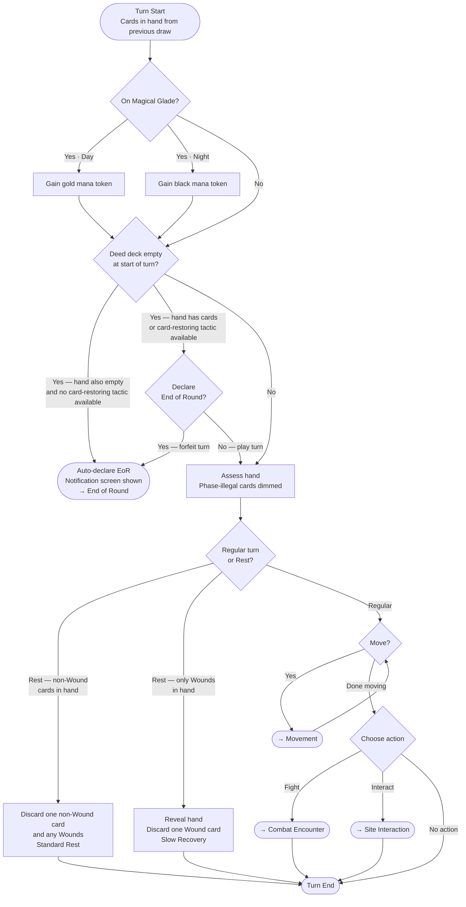

**Slow Recovery emotional design note (Screen Contract item):** The Slow Recovery branch — hand full of only Wounds, forced to discard one — is a designed low point in the emotional arc. The animation, sound cue, and pacing of discarding a Wound card during Slow Recovery should feel weighty and earned, not mechanical. This is a named Sally/Samus Screen Contract item: distinct from Standard Rest, never casual.

**Resting is declared at the start of the turn**, before any movement. When Resting, the
player cannot move, initiate combat, or interact with locals — they must play or discard
at least one card (unless their hand is empty with cards still in the deck).

**If taking a Regular turn**, movement must be completed before any action. Once combat
or a site interaction begins, no further movement is possible — unless the undo gate is
still open, in which case the player may revert the action choice and return to the
movement decision.

**Screen Contract item — Rest choice affordance:** The Turn Loop decision between Regular and Rest must have an explicit UI affordance. Curious players will not know Rest is an option without a visible signal. This is a Screen Contract design question: whether Rest is offered as a named button, inferred from played cards, or surfaced contextually (e.g., when only Wounds are in hand). Assign to Sally in Step 11.

### 2. Movement

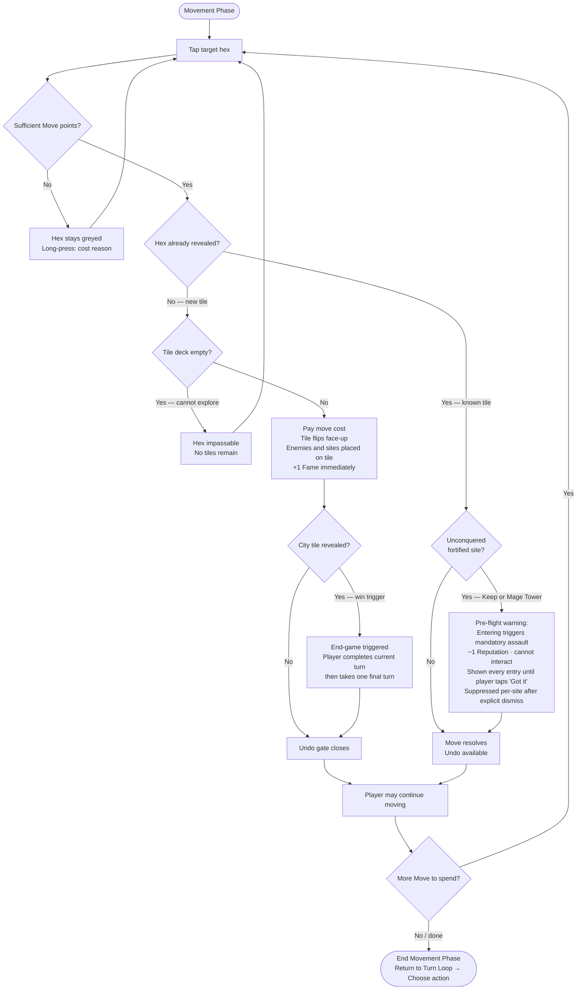

Revealing a new tile populates it with tokens (enemies, sites) but does **not** trigger an
encounter. The player may continue moving after a reveal. Encounters and site interactions
are chosen after movement ends, back in the Turn Loop.

**First Reconnaissance special rule:** The player scores 1 Fame immediately upon revealing
any tile, regardless of type. The Fame track updates at the moment of reveal; any
resulting level-up is resolved at End of Turn.

### 3. Combat Encounter

```mermaid
flowchart TD
    A([Enter Combat\nN enemies displayed]) --> B[Show all enemies\nArmor · Resistances · Fortification · Abilities · Attacks]
    B --> C[Phase 1: Ranged/Siege — Optional\nSelect one or more enemies as target group]
    C --> CF{Target group contains\ndouble-fortified enemy?}
    CF -->|Yes — remove from group\ncannot be targeted by R/S| CF
    CF -->|No| CS{Remaining target group\nfortification status?}
    CS -->|Single-fortified present| CSF[Siege attacks only for this group]
    CS -->|Non-fortified only| CSN[Ranged or Siege attacks]
    CSF --> RM{Resistant enemy\nmixed with non-resistant\nin target group?}
    CSN --> RM
    RM -->|Yes| RH[All attacks vs this group halved\nround down]
    RM -->|No| D{Play R/S attacks?\nTotal ≥ combined group Armor?}
    RH --> D
    D -->|Skip — no attacks| G
    D -->|Total ≥ combined Armor| E[Targeted enemies defeated\nRemoved from combat]
    D -->|Total < combined Armor\nNo partial damage applied| G
    E --> EA{Any enemies remaining?}
    EA -->|None — all defeated| P
    EA -->|Yes| G
    G[Phase 2: Block\nChoose ONE enemy to block — or pass\nAll other enemies attack unblocked]
    G --> H{One enemy chosen and\nblock total ≥ that enemy's attack?}
    H -->|Yes| HA[Chosen enemy's attack nullified\nAll other enemies attack unblocked]
    H -->|Insufficient or pass| HB[All enemies attack unblocked]
    HA --> AD
    HB --> AD
    AD[Assign Damage\nProcess each unblocked enemy individually\nin player-chosen order]
    AD --> ADL{More unblocked\nenemies to process?}
    ADL -->|Yes — next enemy| ADE{Assign this enemy's\nattack damage to?}
    ADE -->|Unit| UD[Unit Wounded\nSubtract unit Armor from damage\nPoison: place 2 wound cards on unit]
    ADE -->|Hero| HD[Take ⌈damage ÷ hero Armor⌉ wound cards]
    UD --> UDR{Remaining damage\nfrom this enemy?}
    UDR -->|Yes| ADE
    UDR -->|No| KO{Wounds total this combat\n≥ unmodified Hand limit?}
    HD --> KO
    KO -->|Yes — Knock out| L[Discard all non-Wound cards\nCombat continues — units still usable]
    KO -->|No| ADL
    L --> ADL
    ADL -->|All processed| M[Phase 3: Attack\nTarget any group of remaining enemies\nFortification does not apply in this phase]
    M --> MA{Resistant enemy\nmixed with non-resistant\nin target group?}
    MA -->|Yes| MB[All attacks vs this group halved\nround down]
    MA -->|No| N{Pass or play attacks\nTotal ≥ combined target Armor?}
    MB --> N
    N -->|Pass or total < Armor\nNo partial damage| O[Combat ends\nSurviving enemies remain on space]
    N -->|Total ≥ combined Armor| P2[Targeted enemies defeated\nRemoved from combat]
    P2 --> PA{All enemies\ndefeated?}
    PA -->|No — some remain| O
    PA -->|Yes| P[Gain Fame per enemy\nAll enemy tokens removed\nLevel-Up resolved at End of Turn]
    O --> Q([Combat End])
    P --> Q
```

**Multiple-enemy grouping rules:**

- **Ranged/Siege phase:** Double-fortified enemies cannot be included in any target group — they are shown greyed in the targeting UI with a tooltip explaining why (pre-flight education, not silent exclusion). A group containing any single-fortified enemy requires siege attacks only for that group. A group with resistant enemies mixed with non-resistant enemies halves all attacks of that resistance type (round down). Must meet combined Armor of the entire target group — no partial damage.
- **Resistance combining:** Resistances are per-type and combine across enemies in a group. A group containing one physically resistant and one ice resistant enemy is resistant to both physical and ice attacks. Two physically resistant enemies in a group are still only physically resistant — resistance does not double-stack.
- **Block phase:** Only ONE enemy may be blocked per Block phase. All unblocked enemies deal full damage.
- **Assign Damage:** Each unblocked enemy's attack value is processed individually, in player-chosen order. Each enemy's damage is assigned to hero or units before the next enemy is processed. Screen Contract item: all unblocked enemies and their individual attack values must be simultaneously visible during this phase — no additional navigation to see an enemy's attack value.
- **Attack phase:** Fortification no longer applies — all enemies are equally targetable. Resistance combining rule still applies. Victory requires all enemies defeated — partial clears leave survivors on the space.

### 4. Site Interaction

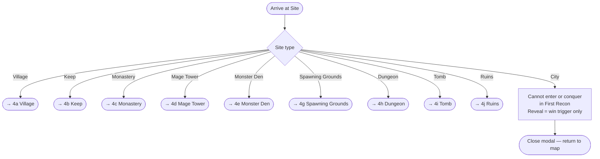

### 4a. Village

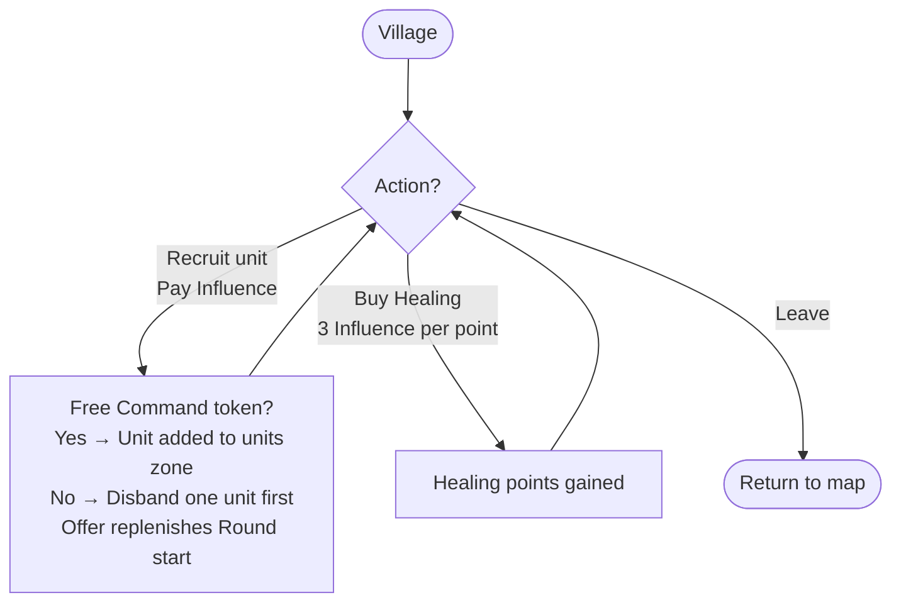

### 4b. Keep

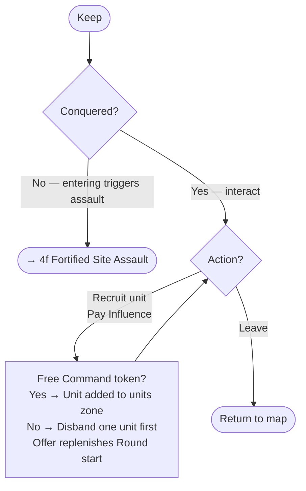

### 4c. Monastery

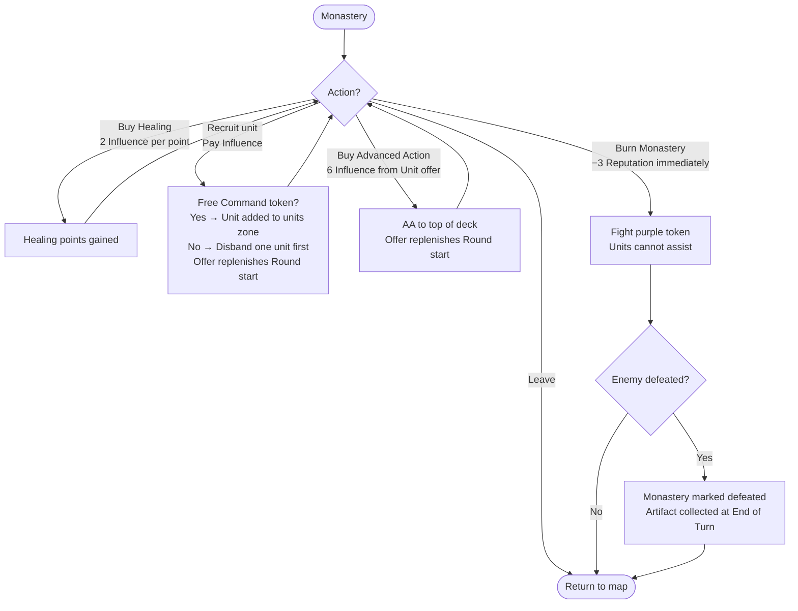

### 4d. Mage Tower

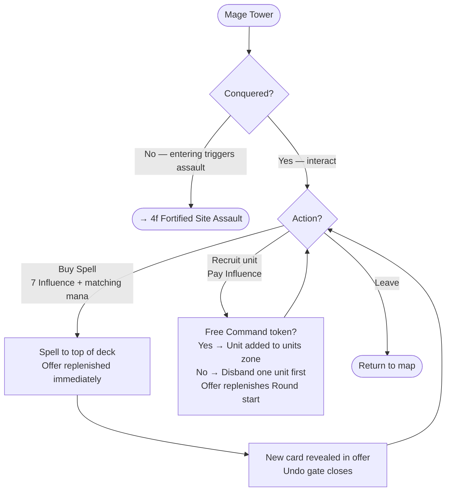

### 4e. Monster Den

One-time only. Draw one random brown enemy token on entry — undo gate closes on draw. Units allowed. No Night Rules. On loss, token stays face up. Once conquered, no further interaction.

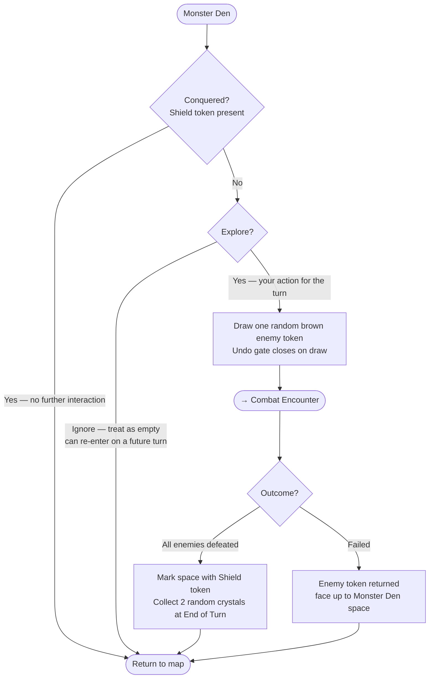

### 4g. Spawning Grounds

One-time only. Draw two random brown enemy tokens on entry — undo gate closes on draw. Units allowed. No Night Rules. On loss, remaining tokens stay face up. Once conquered, no further interaction.

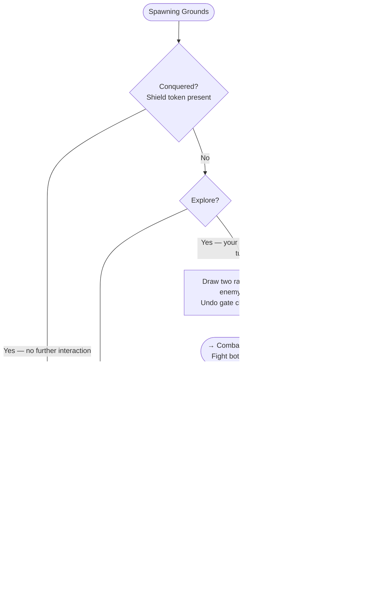

### 4h. Dungeon

No pre-placed token — enemy drawn randomly at combat start. Night Rules apply (gold mana unavailable; black mana usable for powered spells). Units cannot assist. On loss, drawn enemy discarded; new enemy drawn next attempt. Can be entered multiple times — reward and Shield token only on first conquest; repeat visits yield Fame only.

### 4i. Tomb

Red token, drawn randomly at combat start. Night Rules apply (gold mana unavailable; black mana usable for powered spells). Units cannot assist. On loss, drawn enemy discarded; new enemy drawn next attempt. Can be entered multiple times — reward and Shield token only on first conquest; repeat visits yield Fame only.

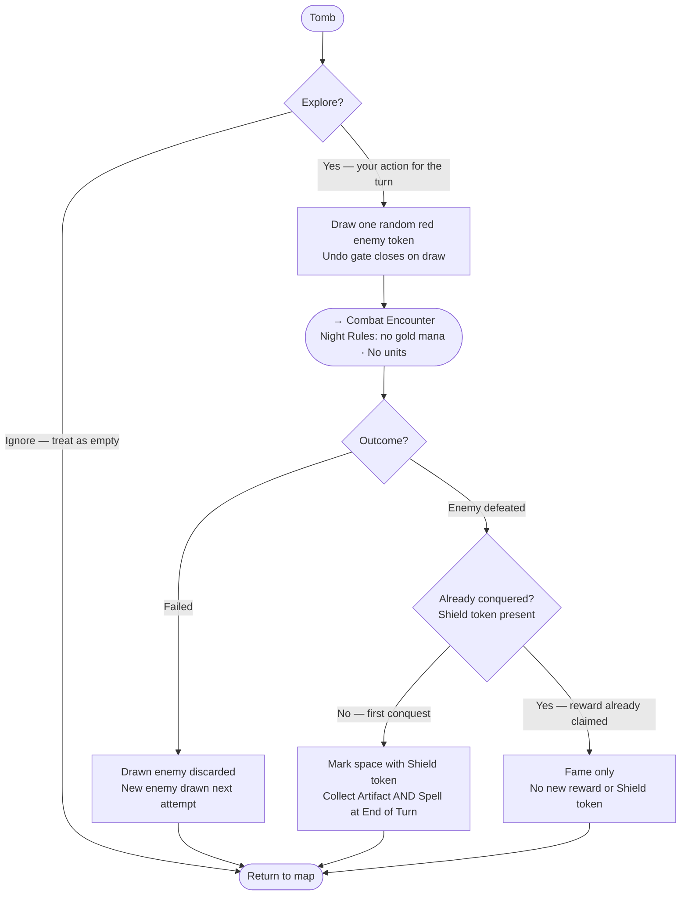

### 4j. Ruins

Yellow ruins token placed at tile reveal: **face up during Day** (visible from anywhere on map), **face down at Night** (revealed when you move onto the space or at next Day Round start — undo gate closes on flip). The token itself depicts what type of ruins it is.

Two ruins types:

- **Ancient Altar**: pay mana for Fame — no combat
- **Enemies With Treasure**: token depicts specific enemies + reward — draw exactly those enemies to fight. Orcs and Draconium in ruins give no Reputation.

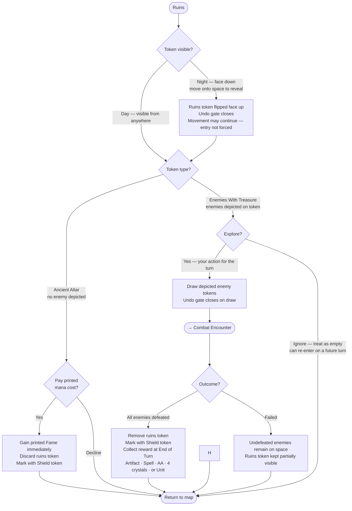

### 4f. Fortified Site Assault

Triggered when player enters an unconquered Keep or Mage Tower. No choice — assault is mandatory.

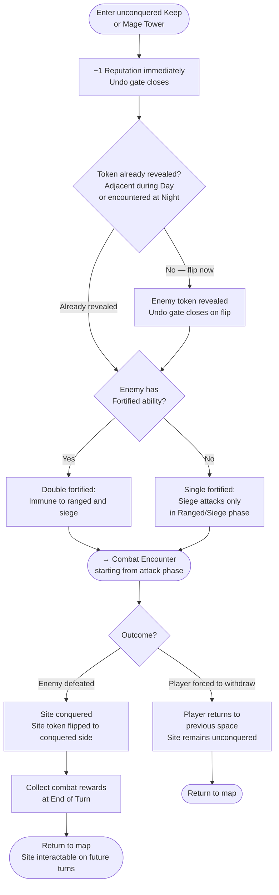

### 5. End of Turn

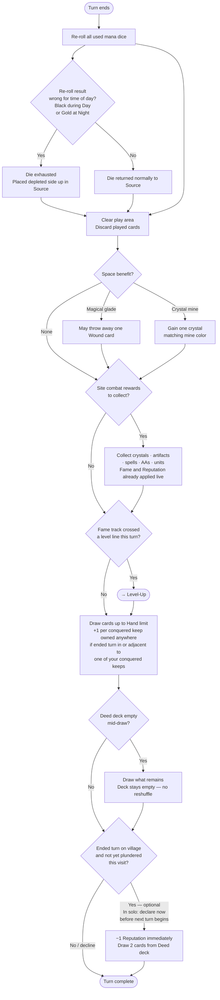

### 5a. Level-Up

Levels 3·7: Command token + Armor. Levels 5·9: Command token + Hand Size. Levels 2·4·6·8·10: Skill + AA.

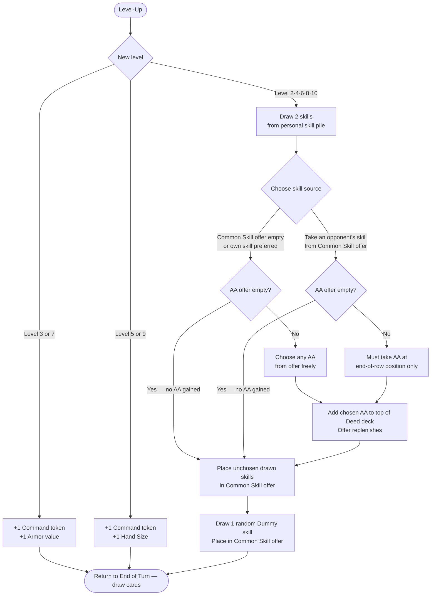

### 6. Session Resume

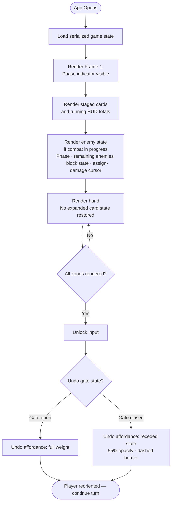

**Screen Contract item — combat state serialization:** If the app is suspended mid-combat, all of the following must be serialized and restored without player interaction: current combat phase; which enemies remain (alive vs. defeated); which enemy was targeted in the Block phase and whether that block succeeded; the assign-damage cursor position (which unblocked enemy is currently being assigned); running wound total this combat (for Knock out threshold); undo gate state. The rendered combat state on resume must be indistinguishable from live state — the player picks up exactly where they left off.

**Screen Contract question for Sally — mid-combat resume reorientation:** On app resume into an active combat, curious players may need ambient orientation beyond rendered state alone (e.g., a brief ambient line: "Phase 2 · Block — choose one enemy to block"). Assess feasibility and design approach in Screen Contract step.

### 7. Mana Selection

When a player plays a Spell or uses a Power action that requires mana, the source is chosen
from available dice and crystal inventory. Source dice are never auto-consumed — they are
only taken when explicitly tapped by the player. Color auto-resolution (skipping the color
picker when only one color is legal) does not bypass the explicit tap requirement on dice.

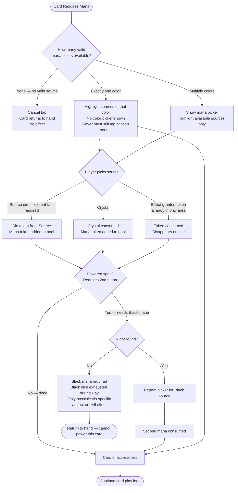

**Source die rule:** A source die is only consumed when the player explicitly taps it. The game never auto-removes a die from the Source. This preserves the player's ability to choose which die to spend and to decline spending a die entirely (e.g., saving a specific color for a later card).

**Color auto-resolution:** When only one mana color is legal, the color picker is skipped and sources of that color are highlighted. The player still taps their chosen source. Multiple valid colors → show full picker with only available sources lit. Exhausted dice and wrong-color crystals are shown greyed, not hidden.

**Powered spells:** Require one basic color + one Black. If not a Night round, the Power
button is pre-flight disabled — the player never attempts a powered play they cannot
complete.

### 8. Round Start / Tactics Selection

Each round begins before the first move. The player selects a Tactics card from the
appropriate Day or Night deck, setting initiative order for the round. The dummy player
receives a random remaining card. The two selected cards are unavailable in future rounds
of the same type — unchosen cards remain available.

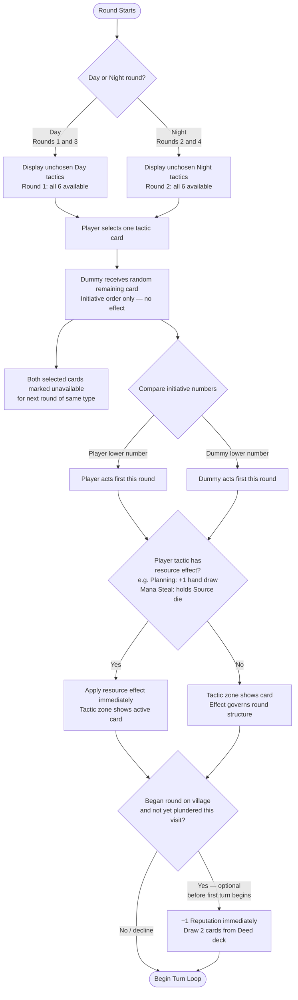

**Tactic zone:** The active tactic card occupies a dedicated zone defined in the Screen
Contract. It is visible for the entire round and removed at round end. Planning (+1 hand
draw) and Mana Steal (holds a Source die) have persistent resource effects; structural
tactics have no zone presence beyond the card itself.

### 9. End of Round

EoR is declared when a player's Deed deck is empty at the start of their turn. The declaring player forfeits their turn. In solo: if the player declares EoR, the round ends immediately. If the Dummy declares EoR, the player takes one final turn before the round ends.

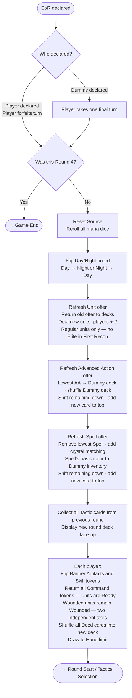

---

### Journey Patterns

Three patterns recur across all flows and must be standardized in the Screen Contract:

**P1 — Back always returns to a named state**
Every flow has a clean exit back to a defined predecessor state: Movement → hexmap; site
modal → hexmap; card expand → hand-assess at same scroll position. No flow exits to an
undefined position.

**P2 — Auto-resolution of single-option decisions**
Whenever only one legal option exists (one valid mana color, one legal target hex, one
valid action) the system resolves silently without prompting. The picker appears only when
genuine choice exists.

**P3 — Undo gate on information reveal**
The undo gate closes on any information reveal event — see the gate event table for the
complete and authoritative list. The pattern is consistent across all flows: functional
close is immediate on the reveal trigger — on the event itself, not on animation completion.
The visual signal (55% opacity, dashed border, −10% scale) fires within 150ms of the
trigger. This list will grow as more game systems are specified.

**P4 — Knock out composes with site exit rules**
When a Knock out occurs inside a site combat (Dungeon, Tomb, Monster Den, etc.), both
the Knock out consequence (discard all non-Wound cards) and the site-specific loss path
apply. Knock out ends combat; the site flow's failure branch then executes normally.
The two outcomes are independent and both fire — they do not cancel each other.

**P5 — Unavailable cards carry two distinct icon overlays**
A card can be unavailable for two mechanically distinct reasons: phase-illegal ("wrong phase — wait") or resource-insufficient ("you don't have the mana/influence"). These are different emotional states and require different player responses. Both are communicated via icon overlay in addition to the greyed treatment: a **clock/phase symbol** for phase-illegal, a **resource-pip symbol** for resource-insufficient. Icons must be distinct in silhouette — not just color — so they read at compact card size and in all lighting conditions. Full spec in Step 11 Component Strategy.

**P6 — Level-Up is a post-turn queue item, never a combat interrupt**
Level-Up resolves at End of Turn, after all combat and site interactions for that turn are fully closed. If a Level-Up threshold is crossed mid-combat (e.g., defeating an enemy earns enough Fame), a subtle pulse indicator appears on the HUD Fame track during combat — the full Level-Up screen surfaces only after the combat sequence closes and the turn advances to End of Turn. Level-Up is never a modal interrupt.

**P7 — EoR auto-declares when no further play is possible**
If a player's deed deck is empty at turn start AND their hand is empty AND no available tactic can restore cards to hand or deck, End of Round is declared automatically. A notification screen is shown — "Declaring End of Round: no cards remain" — so the player understands what happened. Auto-declaration is never silent. If the deck is empty but the hand still has cards, the player is offered a choice: declare now (forfeiting remaining hand) or continue playing.

### Flow Optimization Principles

**Pre-flight disable, not post-flight explain**
Every flow shows illegal actions greyed before the player attempts them. The Power button
on a spell during Day is already disabled. A hex is already greyed if move cost exceeds
available Move. The player never executes an action only to be told it failed.

**Progressive disclosure: three steps maximum**
From any flow entry point to a played card: hand-assess → expand → action button. No flow
requires more than three steps to reach commitment. Mana selection is embedded in the play
sequence, not a modal gate before it.

**Exit states are always playable**
Every flow branches to a resumable game state. Combat ends at enemy-defeated or
combat-end. Site Interaction ends at modal-close. Mana selection ends at pool-updated. No
flow exits mid-state.

**Minimal undo exposure**
The undo affordance is present throughout all flows but visually recedes in committed
states (3+ cards staged). The safety net remains visible without encouraging casual use of
a gate-closing tool.

---

## Component Strategy

### Design System Components

Magus Warrior uses a token-first custom design system (DesignTokens.tres, day.theme/night.theme)
rather than an off-the-shelf library. All components — carried-forward and new — are built
on this foundation: design tokens for spacing, colour, typography, and animation curves.

**10 Carried-Forward Components** (defined in Design System Foundation, Steps 1-10):

| Component | Role |
|-----------|------|
| MapHex | Hex tile with terrain type, movement cost overlay, exploration state |
| EnemyDisplay | Single enemy token renderer; exposes EnemyResistanceProfile to TargetingOverlay |
| CardCompact | Card in hand (compact view); `wound_sideways_permitted: bool` injected via GamePhaseState |
| CardExpanded | Full card detail; Power button enabled when `nightRulesActive` (Night round OR Dungeon/Tomb OR Amulet of Darkness) |
| ManaOrb | Single mana token; shape + colour encoding (shape language locked as Phase 1 blocker) |
| HandPanel | Scrollable card hand container |
| PhaseBar | Current phase indicator (Movement / Influence / Combat / End Turn) |
| UnitToken | Unit in play; `wound_count: 0/1/2` rendered as pip indicators (Poison can double-wound) |
| TacticsCard | Tactics tile; `mana_steal_die_held` displays die, `mana_steal_die_used` removes it — die rerolled and returned to Source at end of the turn it was used |
| ResourceBar | Gold / reputation / fame / crystals HUD |

**Gap Analysis — what the design system does not cover:**

- Group combat visualization (multi-enemy staging, turn-order display)
- Phase-specific targeting overlay with dynamic resistance computation
- Multi-step rest flows with sequential state gating
- Mana die roller (Source management)
- End-of-run screens with narrative framing
- Contextual help and veteran toggle
- Phase transition animations
- Damage feedback animations

---

### Custom Components

**14 Custom Components** built on design system tokens:

---

#### 1. HexMapContainer

**Purpose:** Viewport manager for the procedural hex grid.
**Usage:** Wraps MapHex instances; owns pan/zoom gesture handling and fog-of-war layer.
**Anatomy:** Camera2D viewport, HexGrid node, fog mask, coordinate-to-pixel converter.
**States:** `exploring` (normal navigation), `move_targeting` (valid hexes highlighted), `locked` (during combat or modal).
**Variants:** None — single instance per game session.
**Accessibility:** Large tap targets on hex selection (minimum 48dp); current hex announced on focus.
**Interaction Behavior:** Pinch to zoom, drag to pan, single tap to select. Touch model conflicts with Godot defaults — allocate extra implementation time for gesture disambiguation on Android.

---

#### 2. CombatStack

**Purpose:** Turn-order and running-total visualization for group fights and sieges.
**Usage:** Active during Combat phase; shows all enemies simultaneously (battlefield assessment, not serial queue).
**Anatomy:** Simultaneous enemy display with resistance badges; running attack/block totals; phase-segment tabs (Ranged → Block → Assign → Attack).
**States:**

- `ranged_siege` — all targetable enemies visible; total attack running
- `block_phase` — enemy attacks visible; player block total running
- `assign_damage` — damage-split controls active per enemy
- `attack_phase` — final resolution staged, waiting for confirm
- `knock_out_mid_assignment` — player Wounds exceed KO threshold during Assign Damage; non-Wound hand cleared but combat continues; distinct visual treatment signals the designed low point
- `resume_orientation_banner` — app resumed mid-combat; ambient banner ("Phase 2 · Block — choose one enemy to block") fades in 300ms, holds 2.5s, fades out; rendered when `app_resumed_mid_combat: bool`

**Variants:** Group fight (multiple enemies) vs. solo target.
**Accessibility:** Running totals in persistent HUD strip; phase announced on transition.
**Content Guidelines:** All enemies visible simultaneously; resolution order as secondary badge, not primary hierarchy — preserves physical "battlefield assessment" feel over serial queue feel.
**Interaction Behavior:** Player declares attacks on the GROUP where possible; individual targeting only for Ranged/Siege phase exclusions (double-fortified targets).

---

#### 3. TargetingOverlay

**Purpose:** Phase-specific overlay that appears over enemy display area during targeting; computes group resistance dynamically.
**Usage:** Appears during Ranged and Siege targeting phases; removed after phase ends.
**Anatomy:** Overlay layer above EnemyDisplay instances; reads `EnemyResistanceProfile` from each enemy; renders resistance badges and exclusion indicators.
**States:**

- `targetable` — enemy is a valid target; normal highlight
- `resistant_mixed` — enemy is in a group with active resistance to the attack type; halved-attack indicator
- `targeting_excluded` — enemy cannot be targeted this phase (e.g. double-fortified during Ranged/Siege); greyed with `wound_sideways_permitted`-style tooltip explaining exclusion

**Variants:** Ranged phase vs. Siege phase (exclusion rules differ).
**Accessibility:** Resistance badges use shape + colour; exclusion tooltip on tap for colour-blind players.
**Content Guidelines:** Cold Fire resistance must be computed explicitly — a group containing one fire-resistant enemy AND one ice-resistant enemy resists Cold Fire attacks at the group level, even though no individual enemy has explicit Cold Fire resistance. TargetingOverlay owns this conjunction logic; it does NOT delegate it to EnemyDisplay.
**Interaction Behavior:** Reads `EnemyResistanceProfile` structs (typed, not reaching into EnemyDisplay internals); recomputes dynamically as enemies are added/removed from group.

---

#### 4. DiceRoller

**Purpose:** Mana die roll interface for Source management.
**Usage:** Start-of-round Source roll; any re-roll triggered by card or skill effects.
**Anatomy:** Die face display (colour + shape-coded per mana type); roll animation; result confirmation.
**States:** `idle`, `rolling` (animation), `result_shown`, `confirmed`.
**Variants:** Day palette vs. Night palette die faces.
**Accessibility:** Die result announced as text after roll.
**Interaction Behavior:** Source roll at start of round is a game RITUAL — animation and haptic feedback should carry weight, not feel like a menu refresh. This is a designed moment.

---

#### 5. ActionConfirmation

**Purpose:** Two-tap confirm flow for irreversible actions.
**Usage:** Blocking (card commitment), burning cards for resources, sacrificing units.
**Anatomy:** Action summary label, Confirm button, Cancel button.
**States:** `pending` (awaiting second tap), `confirmed`, `cancelled`.
**Variants:** None — binary confirm flow only. For variable-option decisions, use ContextMenu.
**Accessibility:** Confirm button minimum 48dp; destructive action framed in plain language ("Burn this card — cannot be undone").
**Content Guidelines:** Forbidden from use for decisions that ContextMenu owns (mana colour choice, multi-option sacrifice).

---

#### 6. RestDeclarationPrompt

**Purpose:** Owns the "declare rest vs. regular action" decision moment at turn start.
**Usage:** Surfaces as a contextual prompt when hand composition suggests rest is available (majority Wounds, or at end of turn without having played all actions). Distinct from RestChoiceAffordance — this component owns the DECLARATION; RestChoiceAffordance owns the EXECUTION.
**Anatomy:** Contextual prompt modal; "Rest" button, "Continue Turn" button; brief hand-state summary ("5 cards, 3 Wounds").
**States:** `offered` (prompt visible), `rest_chosen` (hands off to RestChoiceAffordance), `dismissed` (player continues without resting).
**Variants:** Standard Rest path vs. Slow Recovery path (determined by hand composition before handoff).
**Accessibility:** Prompt appears during non-decision moment, not during an active phase action.
**Interaction Behavior:** Physical Mage Knight has a distinct cognitive moment — pick up hand, assess wounds, decide whether to rest. This component owns that moment. RestChoiceAffordance handles what happens after the decision.

---

#### 7. RestChoiceAffordance

**Purpose:** Manages the Standard Rest card discard flow after rest has been declared.
**Usage:** Active after player selects Rest from RestDeclarationPrompt; handles sequential discard flow.
**Anatomy:** Discard slot (non-Wound card required); Wound discard section (gated); End Turn button (gated by `rest_discard_fulfilled`).
**States:**

- `awaiting_non_wound_discard` — player must discard at least one non-Wound card; End Turn disabled; discard slot pulses with invitation
- `non_wound_discarded` — `rest_discard_fulfilled: true`; Wound discards now available; End Turn enabled
- `slow_recovery_beat` — player has only Wounds in hand; system auto-discards one Wound (animated); player retains control for skills/units before manually ending turn (see SlowRecoveryBeat animation state)
- `complete` — ready to end turn

**Variants:** Standard Rest (non-Wound discard required) vs. Slow Recovery (automatic wound discard).
**Accessibility:** End Turn button label changes to "Discard a card first" when gated; discard slot pulse provides affordance without verbal instruction.
**Content Guidelines:**
- Playing healing or Special cards while resting does NOT fulfil the mandatory non-Wound discard — it is a separate, explicit action.
- Non-Wound discard must complete before any Wound discards are offered — sequential, not simultaneous.
- End Turn is gated until `rest_discard_fulfilled: true`.
- In Slow Recovery path: all Wounds are identical; no picker UI; system discards automatically with animation notification. Player may still use skills or unit abilities before manually ending turn.

**SlowRecoveryBeat (animation state within RestChoiceAffordance):**
Not a standalone component — an animation track within RestModal. When `slow_recovery_beat` state activates: a specific Wound card fans slightly and animates off the discard slot (visually distinct from the player manually discarding); a low resonant audio cue plays; the system status message reads "Slow Recovery — Wound discarded." Player retains full control afterward.

---

#### 8. ContextMenu

**Purpose:** Radial or list menu for multi-option decisions with runtime-dynamic option count.
**Usage:** Mana colour selection, sacrifice choice, site interaction options.
**Anatomy:** Anchored to trigger point; option list (2–6 items); dismiss on outside tap.
**States:** `open`, `option_highlighted`, `confirmed`, `dismissed`.
**Variants:** Radial (<=4 options) vs. list (5-6 options).
**Accessibility:** Options announced on focus; minimum 48dp touch targets.
**Content Guidelines:** For binary irreversible actions, use ActionConfirmation instead.

---

#### 9. HelpTooltip

**Purpose:** Contextual rule explainer; respects veteran toggle.
**Usage:** Any component that needs to surface rule explanation emits a `help_requested` signal with content string; HelpTooltipManager owns the anchor zone and renders it.
**Anatomy:** Fixed anchor zone — bottom strip, above hand zone, z-layer 5. Components do NOT position tooltips independently; they emit signals.
**States:** `visible`, `hidden` (when `showHelpText: false` via veteran toggle).
**Variants:** Short rule note vs. extended explanation.
**Accessibility:** Tooltip text reads as plain language; dismiss on tap.
**Content Guidelines:** Veteran toggle surfaces at first tutorial trigger during a non-decision moment. Components emit `help_requested`; HelpTooltipManager renders. No component independently calculates tooltip position — this prevents z-order and position collisions.

---

#### 10. LossScreen

**Purpose:** End-of-run loss state with narrative framing.
**Usage:** Triggered on KO, round limit exceeded, or scenario failure condition.
**Anatomy:** Narrative headline; accomplishments summary; stat row; retry/menu actions.
**States:** Single state with variable data.
**Data Inputs:** `tiles_revealed_count: int`, `total_tiles: int`, `capability_delta: RoundSnapshot[]`, `accomplishments: string[]` (enemies defeated, spells cast, level-ups achieved).
**Variants:** None.
**Accessibility:** Screen readable as narrative text.
**Content Guidelines:**

- Lead with FEELING, support with stat: headline is the story beat ("The Reconnaissance Failed"), not the number.
- "Thomas retreated, having revealed [X] of [Y] territories." — NEVER "X hexes from the city" (city tile position in the deck is unknown until revealed; it is randomly among the last 3 tiles).
- Accomplishments section always present — even a loss acknowledges what the player achieved.
- capability_delta shows hand quality progression across rounds (emotional design: the player sees how they grew even in defeat).

---

#### 11. WinScreen

**Purpose:** End-of-run victory state.
**Usage:** Triggered on scenario completion (city reached and entered).
**Anatomy:** Thomas portrait reveal (full art); fame/reputation final totals; scenario time; menu actions.
**States:** Single state.
**Variants:** None.
**Accessibility:** Portrait described via alt text for screen readers.

---

#### 12. PhaseTransitionOverlay

**Purpose:** Full-screen transition animation between major game phases and rule-state shifts.
**Usage:** End of Movement phase, entering Combat, end of Round, Day→Night transition, Dungeon/Tomb entry.
**Anatomy:** Full-screen tint layer; phase label; directional sweep animation.
**States / Variants:**

- `phase_transition` — standard movement-to-combat or end-of-round transition
- `round_start` — new round begins; day/night banner visible
- `night_rules_activation` — nightRulesActive flips mid-round (Dungeon/Tomb entry); distinct visual treatment signals world-shift; learning-critical beat for curious players

**Accessibility:** Transition skippable by tap after 500ms.
**Content Guidelines:** Night Rules activation must feel like a world-shift — physical players flip the night token; this overlay is the digital equivalent.

---

#### 13. RoundSummaryModal

**Purpose:** End-of-round summary (fame gained, level-up prompt, wounds taken).
**Usage:** Triggered at end of each round before the next round begins.
**Anatomy:** Fame delta; wound tally; level-up prompt if threshold crossed; continue button.
**States:** `summary_only`, `level_up_available` (Level-Up prompt inset).
**Variants:** None.
**Accessibility:** All values read as plain text.
**Content Guidelines:**

- Queue order: when Level-Up and Round Summary both trigger on the same turn, Round Summary resolves first, then Level-Up screen. This order is enforced in the Screen Contract.
- Level-Up surfaces after combat closes; RoundSummaryModal surfaces at End of Round. If level occurs on final turn of a round, Summary appears first.

---

#### 14. DamageAnimator

**Purpose:** Floating damage numbers and hit flash animation.
**Usage:** Any component that emits a damage event; DamageAnimator is a pure presentation layer with no game-state reads.
**Anatomy:** Floating label spawned at damage origin; hit flash on target component; brief scale pulse.
**States:** `animating`, `complete` (auto-despawns).
**Variants:** Positive (healing), negative (damage), neutral (blocked/resisted).
**Accessibility:** Damage numbers supplement (not replace) the stat readouts in CombatStack.
**Content Guidelines:** A stub version (200ms number flash, no float animation) should be built in Phase 1 as a debugging aid — verifying state update timing during combat requires some visual feedback. Full animation in Phase 4.

---

### Component Implementation Strategy

**Foundation:** All components built on DesignTokens.tres; day.theme/night.theme swap at runtime via theme override.

**mock_state export discipline:** Every component exposes a typed `MockState` inner class (C# typed resource). Both the real game state injector and the mock export implement the same `IComponentState` interface. If the real game state contract changes, the mock fails to compile — compiler-enforced sync prevents mock drift. This enables isolated development and testing of any component without running the full game loop.

**GamePhaseState contract:** GamePhaseState is a *state-only* flat observable record — no behavioral logic. It computes nightRulesActive from injected booleans (isNightRound, isInDungeonOrTomb, isAmuletActive) via a bitmask — not hardcoded conditionals. Adding a new Night Rules condition is a new input wire, not surgery. Components read from GamePhaseState; they do not write to it.

**EnemyResistanceProfile:** A typed struct that EnemyDisplay exposes and TargetingOverlay consumes. Data flows up to TargetingOverlay; display decisions flow down to EnemyDisplay. TargetingOverlay never reaches into EnemyDisplay internals.

**ResourceState contract:** Defined in Phase 1 even though ResourceBar (the visual component) ships in Phase 2. CombatStack depends on the *data shape*, not the visual component. This prevents a forward dependency from Phase 1 work onto Phase 2 components.

**HelpTooltipManager:** A global autoload that owns the tooltip anchor zone (bottom strip, above hand zone, z-layer 5). Components emit `help_requested(content: String)` signals; HelpTooltipManager renders. No component independently positions a tooltip.

**Mana shape language:** Locked as a Phase 1 implementation blocker. Before any mana-rendering code is written (ManaOrb, DiceRoller), the six mana type shapes must be defined and recorded in the Screen Contract. Deferred shape language creates a retrofit risk across multiple Phase 1 components.

---

### Implementation Roadmap

**Phase 0 — Vertical Slice (first playable):**
Build this before any other component work to validate the core architecture.

- CombatStack (prototype in isolation against 5 mock states: empty / card played / block phase / assign damage / attack resolution)
- CardCompact (card staged into CombatStack)
- PhaseBar (phase context visible)
- ActionConfirmation (irreversible action confirm)

If CombatStack renders correctly against all five mock states, the component architecture is proven. Everything else is execution. This is the riskiest component — if combat feels broken, nothing else matters.

**Phase 1 — Core Combat Loop:**

- MapHex, EnemyDisplay, TargetingOverlay, ManaOrb, DiceRoller
- CardExpanded (full card detail)
- ResourceState data contract (even though ResourceBar ships in Phase 2)
- DamageAnimator stub (200ms flash only — debugging aid for state update timing)
- HelpTooltip data contract (ActionConfirmation needs to know whether to display help text)
- LossScreen placeholder ("Game Over" text only — needed to verify combat can end Thomas)
- WinScreen placeholder ("Victory" text only)

**Phase 2 — Rest and Recovery:**

- RestDeclarationPrompt
- RestChoiceAffordance (including SlowRecoveryBeat animation state)
- HandPanel
- UnitToken (wound_count pip indicators)
- ResourceBar (visual component; data contract already defined in Phase 1)

**Phase 3 — Map and Exploration:**

- HexMapContainer (allocate extra time — Android touch gesture model in Godot will require careful tuning)
- PhaseTransitionOverlay (including night_rules_activation variant)
- RoundSummaryModal
- TacticsCard (mana die held/used states)

**Phase 4 — Context and Help:**

- ContextMenu
- HelpTooltip (full UI, anchor zone, veteran toggle)
- DamageAnimator (full floating number animation)

**Phase 5 — End States:**

- LossScreen (full narrative + accomplishments)
- WinScreen (Thomas portrait reveal)

This roadmap prioritizes getting to a playable combat loop as fast as possible, then layering in rest/recovery, then map, then polish, then end states. Each phase is independently testable via mock_state exports before integration.

---

## UX Consistency Patterns

### Action Hierarchy

Every interactive element falls into one of four tiers governing visual weight, not position — layout is defined by the Screen Contract.

| Tier | Examples | Visual treatment |
| --- | --- | --- |
| Primary (standard) | Play Card, Interact, Assault, Provoke, End Phase | Full weight — default button style, 44dp touch target |
| Primary (heavy) | End Turn | Distinct accent color + 56dp touch target — the only player-chosen action that is always irreversible |
| Secondary | Cancel, Play Sideways | Receded; positionally distinct — Cancel at top of expanded card action strip, never adjacent to primary actions |
| Gate-closing | Explore (tile reveal), card draw, die roll | Primary treatment + persistent lock icon indicating the undo gate will close on execution |

**Gate-closing first-time tooltip:** On the first gate-closing action a player encounters, a one-time tooltip fires: "This will lock in your previous moves." Gated behind `showHelpText`; dismissed forever after. The specific inventory of gate-closing actions is enumerated during story definition.

**Play when native effect unavailable:** When a card has no phase-relevant native effect (e.g. a combat card in Movement phase), the Play button is greyed out — not hidden. Play Sideways becomes the de-facto primary action. Greyed Play signals "this exists but isn't available right now" without removing information.

**Cancel is always secondary.** Never promoted to primary weight regardless of context.

---

### Feedback Patterns

**Disabled card interaction:**

- Tap: haptic feedback + subtle background color shift (grey → black) + brief subtitle explaining why (e.g. "Not available in Move phase"), auto-dismissing after 1.5s. Signals "heard you, not legal" with immediate explanation.
- Tap also opens CardExpanded in view-only mode: action buttons greyed, "?" accessible for rule context. This is the proactive learning path — consistent with tap=expand, no new component needed.
- Long press: removed. CardExpanded on tap handles full card text.
- When haptics are disabled at system level, the color shift + subtitle alone is sufficient signal.

**Mana selection:**

- Source die: greys out on use; persists until end-of-turn reroll or undo.
- Mana crystals: count indicator for the corresponding color decrements immediately on selection. Tap a selected crystal to deselect — count increments back up. Crystal selection is never a gate event; deselection is freely allowed until a gate event locks the current undo stack.
- Running mana total updates synchronously on every selection.

**Single-card multi-effect resolution:**

- Independent additive effects (e.g. Move 2 + Influence 1): HUD updates simultaneously.
- Conditional or branching effects (e.g. "Attack 2, or take a Wound, Attack 5"): sequential — player decision required mid-resolution. HUD freezes at the pre-card state until the player completes their decision and the full effect resolves. Sequencing is determined per card; a complete card audit for Thomas's starting deck and First Reconnaissance acquirable cards should be completed before the combat epic begins.

---

### Undo Stack Pattern

Undo operates on rolling stacks, not a single monolithic history.

- **Within a stack:** undo is freely available; affordance shows at full weight.
- **Gate event:** current stack locks permanently (pre-gate actions frozen); new stack begins immediately; undo affordance recedes while the new stack is empty.
- **New stack:** all post-gate actions accumulate and are freely undoable until the next gate event or end of turn.
- **End of turn:** current stack clears.

Undo never reaches across a gate boundary — it operates only on the current stack. The receded undo state (55% opacity, dashed border, ~10% scale reduction) applies when the current stack is empty (immediately post-gate, before new actions are taken).

---

### Modal and Overlay Patterns

**Layer assignments:**

| Situation | Layer | Treatment |
| --- | --- | --- |
| Site interactions (village, mage tower, city) | 4 | Full-screen — always |
| Combat screens | 4 | Full-screen — always |
| Level-Up | 4 | Full-screen |
| Rest Declaration Prompt | 3 | Partial popup, dimmed background — hand visible behind |
| ActionConfirmation (End Turn, post-gate actions) | 3 | Partial, anchored to trigger point |
| Round Summary | 3 | Partial popup when content is small |
| Veteran toggle / "Hide Tips" prompt | 5 | System prompt, always on top |

**Rule:** Site interaction and combat screens are full-screen by definition — these demand full player attention. Confirmation and administrative screens use partial popup with dimmed background when content doesn't fill the screen. Dimmed background signals consequence without full occlusion.

**Rest Declaration is Layer 3** specifically because the player needs their hand visible — the decision is about hand composition, not map state. The map being out-of-focus signals consequence.

**Site→combat transition:** Site interaction always fully dismisses before combat loads. No suspended state, no "return to site" path — game rules eliminate the scenario where a player would need to return to a site mid-combat.

**Rest Declaration and ActionConfirmation never appear simultaneously.**

Layer assignment is a CanvasLayer value in Godot, not coupled to game logic. Low-cost to change during feel-testing.

---

### Phase Transition Patterns

**Major transitions** (round start, Movement→action phase, Day/Night board flip, Night Rules activation) use the full PhaseTransitionOverlay — full-screen tint, phase label, directional sweep.

**In-combat sub-phase transitions** (Ranged/Siege → Block → Assign Damage → Attack) use a lighter treatment — a banner or slide-in indicator without full-screen dimming. Combat flow stays visible behind the transition signal.

**Content:** Phase label only across all variants. No contextual information (enemy count, remaining actions, etc.) — context is available immediately when the indicator clears.

**Duration and skippability:** All variants short. Major transitions skippable by tap after 500ms. Night Rules Activation communicates world-shift through visual treatment, not duration.

**Automatic phase skipping:** When a phase is skipped by game conditions (all enemies eliminated in Ranged → subsequent phases skipped; all damage blocked → Assign Damage skipped), the transition indicator for that phase is also skipped.

---

### Empty and Loading States

**Loading:** Show "Loading..." if session resume exceeds 500ms. All other game state transitions are near-instantaneous — no loading state defined for them.

**Empty offer areas** (Advanced Action offer, Spell offer, Unit offer): rendered as empty space by normal game state. Not a UX loading pattern.

---

### Contextual Help Patterns

Governed by `showHelpText: bool`. All help behavior is on/off — no per-feature granularity.

**Veteran toggle:** Surfaces at the "tap to begin" moment on the player's first run — before any help content fires. Prompt text: **"Hide Tips."** Binary: hide or keep. Veterans opt out immediately; curious players keep tips from the start.

**Re-enabling:** Settings screen in the Pause menu, v1. `showHelpText` can be set back to `true` at any time during a run.

**"?" in CardExpanded:** Appears only on cards with meaningful rule complexity — not on mechanically simple cards (e.g. Move 2). Always visible regardless of `showHelpText` when present. Fires a HelpTooltip with plain-language rule explanation. Veterans can ignore it; curious players tap it for rule context.

**HelpTooltipManager:** Global autoload, bottom strip anchor zone, z-layer 5. Components emit `help_requested(content: String)` — no component positions its own tooltip.

---

### Day/Night Theme Transition Feel

**Palette swap:** Crossfade on the lift of the triggering overlay — the entire screen (map, HUD, hand, all zones) transitions simultaneously. No ripple or stagger.

**Triggers (exactly two):**

1. `round_start` PhaseTransitionOverlay lift — when the Day/Night board flips at the start of a new round
2. `night_rules_activation` PhaseTransitionOverlay lift — on Dungeon or Tomb entry only

**Amulet of Darkness** affects mana availability only (black mana usable during Day round) — it does NOT trigger the theme crossfade or the `night_rules_activation` overlay. The `nightRulesActive` bitmask in the Component Strategy requires updating: `isAmuletActive` governs mana rules, not the theme state, and must not be bundled into `nightRulesActive`.

**Duration:** 300–500ms, tuned during implementation. Applied via `day.theme` / `night.theme` swap on DesignTokens.tres; all components inherit the transition automatically. Future expansion effects may introduce additional trigger points — each must be explicitly added, not inferred.

---

## Responsive Design & Accessibility

### Responsive Strategy

Magus Warrior v1 targets a single platform, orientation, and input model: Android landscape, touch-only, Samsung Galaxy S21 baseline. No responsive breakpoint system is required — the Screen Contract defines a fixed layout for this context. Future platform expansion (tablet, larger phones) would revisit this.

### Accessibility Strategy

**Target:** No formal WCAG compliance level. Colorblind accessibility is in scope. Screen reader support and motion sensitivity accommodations are out of scope for v1.

**Colorblind design rule — shape + color, never color alone:**

All color-coded game elements use shape or iconography as the primary differentiator. Color is additive, not load-bearing:

| Element | Colorblind-safe signal |
| --- | --- |
| Mana types (6) | Distinct shape per type — defined before ManaOrb/DiceRoller implementation (Phase 1 blocker) |
| Mana dice | Shape face on die matches mana type shape |
| Card unavailable | Greyed overlay + icon (not color alone) |
| Phase-illegal vs resource-insufficient | Silhouette-distinct icons (clock shape vs resource-pip shape) |
| Wound cards | Teardrop icon — red background is supplementary |
| Enemy tokens | Image-identified on token face — color is supplementary once placed |
| Day/Night theme | Visual flavor only — gameplay-relevant distinctions (mana availability, phase state) communicated through labels and icons, not palette alone |

**Mana shape language** must be defined and recorded in the Screen Contract before any mana-rendering code is written. This is a hard Phase 1 implementation blocker — shape decisions made after ManaOrb/DiceRoller are built create retrofit risk across multiple components.

### Testing Strategy

- Colorblind simulation testing using Android developer options (deuteranopia, protanopia, tritanopia modes) against the mana shape language and all color-coded elements
- Baseline device testing on Samsung Galaxy S21
- Touch target verification: 44dp minimum across all interactive elements, 56dp for End Turn
