# Class Diagram — Epic 1 Baseline

Generated at end of Epic 1 (branch `epic-2` start). Reflects actual source in `scripts/`.

```mermaid
classDiagram
    namespace Core {
        class GameState {
            +GamePhase CurrentPhase
            +int MovePointsThisTurn
            +int InfluencePointsThisTurn
            +int TotalAttackThisTurn
            +int TotalBlockThisTurn
            +IReadOnlyDict AttackPool
            +IReadOnlyDict BlockPool
            +IReadOnlyList~CardDefinition~ Cards
            +GameEventLog EventLog
            +event Action ResourcesChanged
            +SetPhase(GamePhase)
            +AddMovePoints(int)
            +AddAttackPoints(int, EffectType, AttackElement)
            +TakeSnapshot() GameStateSnapshot
            +RestoreSnapshot(GameStateSnapshot)
        }
        class GameEventLog {
            +IReadOnlyList~EffectFiredEvent~ Events
            +Append(EffectFiredEvent)
            +PopLast() EffectFiredEvent
        }
        class GameStateSnapshot {
            <<record>>
            +GamePhase CurrentPhase
            +int MovePointsThisTurn
            +IReadOnlyDict AttackPool
            +IReadOnlyDict BlockPool
        }
        class EffectFiredEvent {
            <<record>>
            +string SourceCardId
            +EffectType EffectType
            +GamePhase Phase
            +bool Powered
            +GameStateSnapshot StateBefore
        }
        class Result~T~ {
            +bool IsOk
            +T Value
            +string Error
            +Ok(T)$
            +Fail(string)$
        }
        class SaveMigrator {
            +Migrate(SaveData) SaveData
        }
    }

    namespace Cards {
        class CardDefinition {
            +string Id
            +string Name
            +CardType Type
            +ManaColor ManaCost
            +EffectSpec Unpowered
            +EffectSpec Powered
            +EffectType[] AlternateEffectTypes
            +GamePhase[] LegalPhases
        }
        class EffectSpec {
            +EffectType EffectType
            +int Move / Attack / Block / Influence / Heal
        }
        class CardLoader {
            <<static>>
            +ParseAll(string)$
            +LoadAll(string)$
        }
        class WoundCard {
            <<static>>
            +Id$ string
        }
        class SidewaysRule {
            <<static>>
        }
        class RestRule {
            <<static>>
        }
        class ImprovisationRule {
            <<static>>
            +GetAmount(bool) int$
        }
    }

    namespace Effects {
        class IEffect {
            <<interface>>
            +Execute(GameState, EffectContext) Task~EffectResult~
        }
        class EffectContext {
            <<record>>
            +string SourceCardId
            +EffectType ChosenType
            +GamePhase Phase
            +bool Powered
        }
        class EffectResult {
            <<record>>
            +bool Success
            +IReadOnlyList~TriggeredEffect~ Triggered
        }
        class EffectScheduler {
            +Enqueue(IEffect, int, EffectContext)
            +ResolveAll(GameState) Task
        }
        class EffectHookRegistry {
            +Register(HookPoint, IEffectHook)
            +Fire(HookPoint, EffectContext, GameState)
        }
        class IEffectHook {
            <<interface>>
            +OnEffect(EffectContext, GameState)
        }
        class PhaseValidator {
            +Validate(CardDefinition, EffectType, GamePhase) Result~bool~
        }
        class AttackEffect {
            +Execute(GameState, EffectContext)
        }
        class BlockEffect {
            +Execute(GameState, EffectContext)
        }
        class MoveEffect {
            +Execute(GameState, EffectContext)
        }
        class InfluenceEffect {
            +Execute(GameState, EffectContext)
        }
        class ImprovisationEffect {
            +Execute(GameState, EffectContext)
        }
    }

    namespace Deck {
        class DeckManager {
            +IReadOnlyList~CardDefinition~ Hand
            +IReadOnlyList~CardDefinition~ DiscardPile
            +PlayCard(string) Result~CardDefinition~
            +DiscardCard(string) Result~CardDefinition~
        }
        class StagingManager {
            +Stage(EffectResult)
            +Commit(GameState)
            +Rollback()
            +GetTotals() StagingTotals
        }
        class StagingTotals {
            <<record>>
            +int Move / Attack / Block / Influence
        }
    }

    namespace Save {
        class SaveManager {
            <<static>>
            +Save(SaveData)$
            +Load() Result~SaveData~$
        }
        class SaveData {
            +int schema_version
            +GamePhase current_phase
        }
    }

    namespace UI {
        class PlaceholderMainMenu {
            -GameState
            -DeckManager
            -EffectScheduler
            -StagingManager
        }
        class HandView {
            +Initialize(DeckManager, GameState, EffectScheduler, StagingManager)
        }
        class StagingAreaView {
            +Initialize(StagingManager, GameState)
        }
        class ImprovisationView {
            +Initialize(DeckManager, GameState, StagingManager)
        }
        class RestView {
            +Initialize(DeckManager, GameState)
        }
        class EffectEventLogPanel {
            +Initialize(GameState)
        }
    }

    %% Core relationships
    GameState *-- GameEventLog
    GameEventLog o-- EffectFiredEvent
    EffectFiredEvent --> GameStateSnapshot
    GameState --> CardDefinition : Cards[]

    %% Card model
    CardDefinition *-- EffectSpec
    CardLoader ..> CardDefinition : creates

    %% Effect system — clean fan-out via IEffect
    IEffect <|.. AttackEffect
    IEffect <|.. BlockEffect
    IEffect <|.. MoveEffect
    IEffect <|.. InfluenceEffect
    IEffect <|.. ImprovisationEffect
    IEffect ..> GameState : mutates
    IEffect ..> EffectContext
    IEffect ..> EffectResult
    EffectScheduler o-- IEffect
    EffectScheduler ..> GameState : passes to Execute
    EffectHookRegistry o-- IEffectHook
    PhaseValidator ..> CardDefinition
    ImprovisationEffect ..> ImprovisationRule

    %% Deck
    DeckManager o-- CardDefinition
    StagingManager o-- StagingTotals
    StagingManager ..> EffectResult : stages
    StagingManager ..> GameState : commits to

    %% Save
    SaveManager ..> SaveData
    SaveMigrator ..> SaveData

    %% UI — PlaceholderMainMenu is composition root
    PlaceholderMainMenu *-- GameState
    PlaceholderMainMenu *-- DeckManager
    PlaceholderMainMenu *-- EffectScheduler
    PlaceholderMainMenu *-- StagingManager
    HandView ..> GameState
    HandView ..> DeckManager
    HandView ..> EffectScheduler
    HandView ..> StagingManager
    StagingAreaView ..> StagingManager
    StagingAreaView ..> GameState
    ImprovisationView ..> DeckManager
    ImprovisationView ..> GameState
    ImprovisationView ..> StagingManager
    RestView ..> DeckManager
    RestView ..> GameState
    EffectEventLogPanel ..> GameState
```

## Coupling notes

**Good:**
- `IEffect` is a clean fan-out — all 5 concrete effects are decoupled from each other and from their callers
- `EffectScheduler` takes `GameState` as a parameter to `ResolveAll` rather than storing it — no circular ownership
- `DeckManager` and `StagingManager` are independent; neither knows about the other
- Rule helpers (`SidewaysRule`, `RestRule`, `ImprovisationRule`) are pure static — zero state, zero coupling

**Worth watching:**
- `GameState` is unavoidably central — every view and most managers touch it; `ResourcesChanged` being a naked `Action` means views wire directly to state rather than through an event bus
- `GameState`'s default constructor calls `CardLoader` via a Godot file path — a Godot seam baked into core (the `(IReadOnlyList<CardDefinition>)` overload saves testability)
- `PlaceholderMainMenu` is doing composition-root duty — correct pattern for now, will need a proper scene-tree initializer once it's no longer a placeholder
- `HandView` takes 4 injected dependencies — the most of any view, owns the tap→play→stage flow
