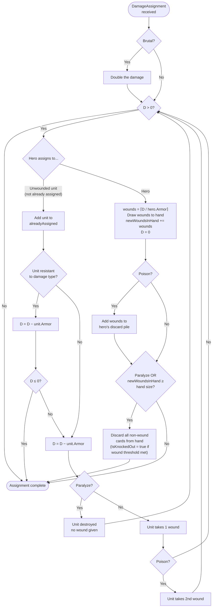

# Combat Flow LLD — Magus Warrior

## 1. Overview

This document specifies the full 4-phase combat sequence, data model, damage computation, phase transitions, and end-of-combat resolution for the Godot/C# implementation.

**Cross-references:**
- Enemy stats, abilities, and CombatGroup construction: `docs/enemy-token-lld.md`
- Card effects interacting with combat (Burning Shield, Agility, Diplomacy, etc.): `docs/effect-lld.md`
- Combat triggers via movement (provocation, entering fortified sites): `docs/hex-movement-lld.md`
- Architecture skeleton, EffectHookRegistry, screen contracts: `_bmad-output/game-architecture.md`

**Solo v1 scope:** All rules apply as written. PvP interactions (attacking another player's figure) are out of scope.

---

## 2. Terminology

| Term | Meaning |
|------|---------|
| CombatGroup | The initial set of enemies the hero fights, plus site configuration. Immutable after construction. |
| ActiveEnemies | Mutable list in CombatState. Initialized from CombatGroup; enemies removed on defeat; new enemies added via Summon. |
| AttackContribution | One hero attack declaration: type, delivery method, value. |
| BlockContribution | One hero block declaration: type, value. |
| DamageAssignment | An unblocked enemy attack to be resolved in Phase 3. |
| CombatState | Mutable, combat-scoped state. Created before ResolveCombat; torn down in TearDownCombatState. |
| CombatResult | Immutable outcome record returned from ResolveCombat. |
| All-or-nothing (hero attacks) | An enemy receives no damage unless the hero's total effective attack meets or exceeds the enemy's armor. |
| All-or-nothing (hero block) | An enemy attack is either fully blocked (0 damage) or fully unblocked (full damage). No partial block. |

---

## 3. Type Definitions

All types below live in `scripts/combat/` unless noted.

### 3.1 Enum Additions

Add to `scripts/core/types/GamePhase.cs`:

```csharp
public enum GamePhase {
    // ... existing values ...
    CombatStart,
    CombatRanged,
    CombatBlock,
    CombatAssignDamage,
    CombatMelee
}
```

Add to `scripts/core/types/` if not already present:

```csharp
public enum AttackType        { Physical, Fire, Ice, ColdFire }
public enum AttackDelivery    { Melee, Ranged, Siege }
public enum BlockType         { Physical, Fire, Ice, ColdFire }
public enum MoveConversionMode { AgilityUnpowered, AgilityPowered }
```

### 3.2 Attack and Block Records

```csharp
public record AttackContribution(AttackType Type, AttackDelivery Delivery, int Value);
public record BlockContribution(BlockType Type, int Value);
```

### 3.3 DamageAssignment

Created when the hero fails to block an enemy attack. Resolved in Phase 3.

```csharp
public record DamageAssignment(
    EnemyTokenInstance Source,     // enemy whose attack was not blocked
    AttackType         DamageType, // attack type declared by this enemy
    int                RawValue    // printed attack value; Brutal doubling applied at resolution
);
```

Poison, Brutal, Paralyze, and Swift are all derived from `Source` at resolution time.

### 3.4 ICombatAttackModifier

Transforms an `AttackContribution` before effective-attack computation. Register instances on `CombatState.AttackModifiers`.

```csharp
public interface ICombatAttackModifier {
    AttackContribution Modify(AttackContribution contrib);
}
```

Example — `PhysicalAttackDoublerModifier` (registered by sword_of_justice powered break):

```csharp
public class PhysicalAttackDoublerModifier : ICombatAttackModifier {
    public AttackContribution Modify(AttackContribution contrib) =>
        contrib.Type == AttackType.Physical
            ? contrib with { Value = contrib.Value * 2 }
            : contrib;
}
```

### 3.5 ICombatPhaseCallback

Fires once at the start of a specific phase, then removes itself.

```csharp
public interface ICombatPhaseCallback {
    GamePhase TriggerPhase { get; }
    Task Execute(CombatState combat, UIBroker broker);
}
```

Examples registered by card effects:

| Class | TriggerPhase | What it does |
|-------|-------------|--------------|
| `BurningShieldCallback` | `CombatMelee` | Prompts hero to assign Fire attack to one enemy |
| `AgilityCallback` | `CombatMelee` | Sets `combat.ActiveMoveConversion` |
| `DiplomacyPoweredBlockCallback` | `CombatBlock` | Sets `combat.ActiveInfluenceConversion` |
| `SummonCallback` | `CombatBlock` | Adds summoned enemy token to `combat.ActiveEnemies` |

### 3.6 CombatState

```csharp
public class CombatState {
    // Identity
    public CombatGroup  Group             { get; init; }
    public bool         IsAtFortifiedSite => Group.IsAtFortifiedSite;
    public bool         IsRuinsContext    { get; init; }
    public RuinsToken?  RuinsToken        { get; init; }
    public GamePhase    CurrentPhase      { get; set; }

    // Enemy tracking (mutable; initialized from Group.Enemies)
    public List<EnemyTokenInstance> ActiveEnemies   { get; } = new();
    public List<EnemyTokenInstance> DefeatedEnemies { get; } = new();

    // Hero attack and block pools (built during each phase)
    // Both cards and unit abilities contribute contributions here
    public List<AttackContribution> AttackPool { get; } = new();
    public List<BlockContribution>  BlockPool  { get; } = new();

    // Unblocked enemy attacks accumulate here for Phase 3 resolution
    public List<DamageAssignment> DamageAssignments { get; } = new();

    // Generic extension points — no per-card fields
    public List<ICombatAttackModifier> AttackModifiers { get; } = new();
    public List<ICombatPhaseCallback>  PhaseCallbacks  { get; } = new();

    // Structural phase-control flags
    public bool UnitDamageLocked          { get; set; } // Into the Heat: units cannot absorb damage
    public bool SkipBlockAndDamagePending { get; set; } // Wings of Wind powered: skip Phases 2 and 3

    // Dynamic conversion modes (set by phase callbacks; source values read from GameState)
    public MoveConversionMode? ActiveMoveConversion      { get; set; } // Agility: move points → attack
    public BlockType?          ActiveInfluenceConversion { get; set; } // Diplomacy powered: influence → block

    // Outcome
    public int FameEarned       { get; set; }
    public int ReputationEarned { get; set; }
}
```

**Invariant:** `CombatState` holds no per-card boolean flags or per-card integer fields. Card-specific and unit-specific contributions go through `AttackPool` and `BlockPool`. Card-specific phase-entry behaviors use `PhaseCallbacks`. Card-specific value transformations use `AttackModifiers`. Any future card requiring new combat state must follow this same pattern.

### 3.7 CombatGroup

Defined in `enemy-token-lld.md`; reproduced here for reference:

```csharp
public class CombatGroup {
    public IReadOnlyList<EnemyTokenInstance> Enemies           { get; init; }
    public bool                              IsAtFortifiedSite { get; init; }
    // All site types (keep, mage tower, city) are equivalent for fortification purposes.
    // Per-enemy fortification is handled via EnemyAbility.Fortified on EnemyTokenInstance.
}
```

### 3.8 CombatResult

```csharp
public record CombatResult(
    bool                     HeroWon,
    bool                     HeroKnockedOut,
    List<EnemyTokenInstance> DefeatedEnemies,
    int                      FameEarned,
    int                      ReputationEarned
);
```

---

## 4. Combat Triggers

| Trigger | How it starts |
|---------|--------------|
| Fortified site assault | Hero moves into an unconquered keep / mage tower / city. Movement ends immediately. The assault is the hero's action for the turn. |
| Rampaging enemy provocation | Hero moves laterally from one adjacent space to another adjacent space of the same token. Movement ends; hero fights that rampager. |
| Rampaging enemy challenge (voluntary) | Hero's action when standing adjacent to a rampaging enemy. Hero may include multiple adjacent rampagers in a single combat. |
| Ruins / Dungeon / Tomb / Den exploration | Hero declares exploration as their action. Enemy tokens drawn per site rules. |

**Fortified site entry:** Moving into a fortified space ends all remaining movement. The hero cannot enter and continue — nor can they assault from an adjacent space. They must enter the space first, after which assault is their only action.

**Reputation cost:** The hero loses 1 Reputation immediately upon entering a fortified site, regardless of combat outcome. Applied by the movement system before `ResolveCombat` is called.

**Rampaging enemies at a fortified site:** Rampagers adjacent to an assaulted site may be added to the same `CombatGroup`. They are not fortified even if the site is; they do not need to be defeated to win the assault. See `enemy-token-lld.md §Rampaging Enemies`.

---

## 5. Phase Sequence

```
Phase 0: Start of Combat      ──► always runs
Phase 1: Ranged Attack        ──► skip if AllEnemiesDefeated
Phase 2: Block                ──► skip if AllEnemiesDefeated
                               ──► also skip if SkipBlockAndDamagePending (Wings of Wind)
Phase 3: Assign Damage        ──► skip if AllEnemiesDefeated
                               ──► also skip if SkipBlockAndDamagePending
Phase 4: Melee Attack         ──► skip if AllEnemiesDefeated
                               ──► runs even if hero is knocked out (skills and units still usable)
End of Combat
```

`AllEnemiesDefeated(combat)` returns `combat.ActiveEnemies.Count == 0`.

---

## 6. CombatResolver

Lives in `scripts/combat/CombatResolver.cs`. All dependencies are injected via constructor; no service locator.

```csharp
public class CombatResolver {
    private readonly GameState          _state;
    private readonly UIBroker           _broker;
    private readonly EffectScheduler    _scheduler;
    private readonly EffectHookRegistry _hooks;

    public CombatResolver(GameState state, UIBroker broker,
                          EffectScheduler scheduler, EffectHookRegistry hooks) { ... }

    public async Task<CombatResult> ResolveCombat(CombatState combat) {
        await ResolveStartOfCombat(combat);
        if (!AllEnemiesDefeated(combat))
            await ResolveRangedPhase(combat);
        if (!AllEnemiesDefeated(combat))
            await ResolveBlockPhase(combat);
        if (!AllEnemiesDefeated(combat) && !combat.SkipBlockAndDamagePending)
            await ResolveAssignDamagePhase(combat);
        if (!AllEnemiesDefeated(combat))
            await ResolveMeleePhase(combat); // not skipped on KO
        var result = BuildResult(combat);
        TearDownCombatState(combat);
        return result;
    }
}
```

### 6.1 Phase Callback Dispatch

Called at the entry to every phase before normal phase logic:

```csharp
async Task FirePhaseCallbacks(GamePhase phase, CombatState combat) {
    var callbacks = combat.PhaseCallbacks
        .Where(cb => cb.TriggerPhase == phase)
        .ToList();
    foreach (var cb in callbacks) {
        combat.PhaseCallbacks.Remove(cb);
        await cb.Execute(combat, _broker);
    }
}
```

Callbacks fire in registration order, serially. All callbacks complete before normal phase logic begins.

### 6.2 SetPhase Helper

```csharp
void SetPhase(GamePhase phase, CombatState combat) {
    combat.CurrentPhase = phase;
    _state.CurrentPhase = phase; // keeps GameState in sync for PhaseGate checks
}
```

---

## 7. Phase 0 — Start of Combat

```csharp
async Task ResolveStartOfCombat(CombatState combat) {
    SetPhase(GamePhase.CombatStart, combat);
    combat.ActiveEnemies.AddRange(combat.Group.Enemies);
    await FirePhaseCallbacks(GamePhase.CombatStart, combat);
    await _broker.ShowStartOfCombatInterstitial(combat);
}
```

**Interstitial:** The UI must display the full enemy lineup — all stats and abilities visible — before any player input is requested. The hero reviews the opposition and may play cards or assign units before confirming. The interstitial awaits explicit "Begin Combat" confirmation.

The hero cannot undo past the start-of-combat interstitial once any undo-gate event has occurred (§15).

---

## 8. Phase 1 — Ranged Attack Phase

```csharp
async Task ResolveRangedPhase(CombatState combat) {
    SetPhase(GamePhase.CombatRanged, combat);
    await FirePhaseCallbacks(GamePhase.CombatRanged, combat);
    await PromptHeroRangedAttacks(combat);
    ResolveHeroRangedAttacks(combat);
}
```

### 8.1 All-or-Nothing Hero Attacks

Hero attacks are all-or-nothing. The total effective attack against a target either meets or exceeds the target's armor (enemy defeated) or it does not (enemy takes no damage). There is no partial damage to enemies at any point in combat.

### 8.2 Hero Ranged Attack Input

The hero may play any number of cards or abilities with `Ranged` or `Siege` delivery. Each source adds one or more `AttackContribution(type, Ranged|Siege, value)` records to `combat.AttackPool`. Unit abilities that grant ranged or siege attack add contributions the same way. The hero may also pass with no ranged attacks.

### 8.3 Fortification and Attack Delivery

Fortification level for a specific enemy is computed per attack:

```csharp
int FortificationLevel(EnemyTokenInstance enemy, CombatState combat) =>
    (combat.IsAtFortifiedSite ? 1 : 0) + (enemy.HasAbility(EnemyAbility.Fortified) ? 1 : 0);
```

All unconquered fortified sites — keeps, mage towers, and cities — contribute equally (1 point). An enemy with the Fortified ability also contributes 1 point. The levels combine:

| Fortification Level | Ranged attacks | Siege attacks |
|--------------------|:--------------:|:-------------:|
| 0 (none)           | Allowed        | Allowed       |
| 1 (site OR Fortified enemy) | Blocked | Allowed |
| 2 (site AND Fortified enemy) | Blocked | Blocked |

A blocked delivery type contributes nothing to effective attack against that target. The hero should be warned before playing attacks that will be blocked.

### 8.4 Targeting and Union-Resistance

The hero declares targets when playing each attack. Multiple contributions may be combined against the same target or spread across multiple targets. Fortification is checked per target.

**Union-resistance:** When combining attacks against multiple enemies, if any target has resistance to a given attack type, that type is halved (round down) across the entire combined declaration. See `enemy-token-lld.md §Resistances`.

### 8.5 Applying Attack Modifiers

Before computing effective attack value, all `ICombatAttackModifier` instances are applied in registration order:

```csharp
int ComputeEffectiveAttack(AttackContribution contrib, CombatState combat) {
    var c = contrib;
    foreach (var mod in combat.AttackModifiers)
        c = mod.Modify(c);
    return c.Value;
}
```

### 8.6 Defeating Enemies

An enemy is defeated when the total effective attack against it meets or exceeds its effective armor:

```csharp
int effectiveArmor = enemy.BaseArmor + enemy.ArmorModifier;
bool defeated = effectiveAttackTotal >= effectiveArmor;
```

Defeated enemies are removed from `combat.ActiveEnemies` and added to `combat.DefeatedEnemies`.

---

## 9. Phase 2 — Block Phase

```csharp
async Task ResolveBlockPhase(CombatState combat) {
    SetPhase(GamePhase.CombatBlock, combat);
    await FirePhaseCallbacks(GamePhase.CombatBlock, combat);
    // SummonCallback fires here; DiplomacyPoweredBlockCallback fires here
    foreach (var enemy in combat.ActiveEnemies.ToList())
        await ResolveEnemyAttackVsHero(enemy, combat);
}
```

### 9.1 Which Enemies Attack

All enemies in `combat.ActiveEnemies` attack once in Phase 2. Every enemy — including Swift enemies — attacks exactly once here.

### 9.2 Influence as Block (Diplomacy Powered)

`DiplomacyPoweredBlockCallback` fires via `FirePhaseCallbacks` and sets `combat.ActiveInfluenceConversion` to the applicable `BlockType`.

When `combat.ActiveInfluenceConversion != null`:
- The Block phase UI shows a "Use Influence as [type] Block" option.
- Available influence is read from `_state.Hero.InfluencePool` (not cached on CombatState).
- If the hero chooses to use it: `combat.BlockPool.Add(new BlockContribution(combat.ActiveInfluenceConversion.Value, influenceToUse))` where `influenceToUse ≤ _state.Hero.InfluencePool`.

Diplomacy unpowered (Block 2, physical) adds `BlockContribution(Physical, 2)` directly to `BlockPool` when played — no callback required.

### 9.3 All-or-Nothing Block Rule

The hero allocates block resources to specific enemy attacks. For each enemy attack:

1. Hero declares block for this attack: sum of all `BlockContribution` values allocated to it, adjusted for efficiency (§9.4) and Swift (§9.5).
2. `totalEffectiveBlock ≥ attackThreshold` → attack fully blocked (0 damage).
3. `totalEffectiveBlock < attackThreshold` → attack unblocked: `combat.DamageAssignments.Add(new DamageAssignment(enemy, attackType, rawValue))`.

Block resources allocated to one attack cannot cover another. Cards and unit abilities both add `BlockContribution` records to `BlockPool` by the same mechanism.

### 9.4 Block Efficiency

Canonical source: `effect-lld.md §Block Efficiency`. Summary table:

| Block Type | vs Physical | vs Fire | vs Ice | vs ColdFire |
|------------|:-----------:|:-------:|:------:|:-----------:|
| Physical   | 1:1         | 2:1     | 2:1    | 2:1         |
| Fire       | 1:1         | 2:1     | 1:1    | 2:1         |
| Ice        | 1:1         | 1:1     | 2:1    | 2:1         |
| ColdFire   | 1:1         | 1:1     | 1:1    | 1:1         |

"1:1" = 1 block point blocks 1 attack point. "2:1" = 2 block points required to block 1 attack point. All block types can block all attack types. ColdFire block is the only universally efficient type.

### 9.5 Swift: Double Block Threshold

An enemy with the Swift ability requires twice the normal block to be stopped:

```
attackThreshold = enemy.AttackValue * (enemy.HasAbility(Swift) ? 2 : 1)
```

Block type efficiency (§9.4) is applied to the hero's committed block against this threshold. If the attack goes unblocked, damage dealt is the **printed** attack value — Swift makes the enemy harder to block, not harder to survive.

**Example:** Swift Fire enemy, Attack 5. Block threshold = 10. Ice block at 1:1 vs Fire: need 10 Ice block. Physical block at 2:1 vs Fire: need 20 Physical block. If unblocked, `DamageAssignment.RawValue = 5`.

---

## 10. Phase 3 — Assign Damage Phase

```csharp
async Task ResolveAssignDamagePhase(CombatState combat) {
    SetPhase(GamePhase.CombatAssignDamage, combat);
    await FirePhaseCallbacks(GamePhase.CombatAssignDamage, combat);
    var alreadyAssigned = new HashSet<UnitInstance>(); // units may only be assigned damage once per combat
    int newWoundsInHand = 0;                           // tracks KO threshold across all assignments
    foreach (var assignment in combat.DamageAssignments)
        await ApplyOneDamageAssignment(assignment, alreadyAssigned, ref newWoundsInHand);
    // Phase 4 still runs even if hero is knocked out
}
```

### 10.1 Damage Assignment Algorithm

The following logic runs for each `DamageAssignment`. Once damage reaches zero at any step, the assignment ends with no further wounds dealt.

**Step 1 — Double the damage for Brutal:**
```csharp
int d = assignment.RawValue;
if (assignment.Source.HasAbility(EnemyAbility.Brutal)) d *= 2;
```

**Step 2 — Assignment loop** (repeats until d = 0):

> **Option A — Assign to a unit** (blocked if `combat.UnitDamageLocked`; only units not in `alreadyAssigned` may be selected):
> ```csharp
> alreadyAssigned.Add(unit); // unit is "used up" this combat regardless of outcome
> if (unit.HasResistanceTo(assignment.DamageType)) d -= unit.Armor;
> if (d <= 0) break; // resistance absorbed all damage; no wound
> d -= unit.Armor;   // armor always subtracted; resistant units have armor subtracted twice total
> if (assignment.Source.HasAbility(EnemyAbility.Paralyze)) {
>     unit.Destroy(); // destroyed without a wound
> } else {
>     unit.TakeWound();
>     if (assignment.Source.HasAbility(EnemyAbility.Poison))
>         unit.TakeWound(); // second wound for Poison
> }
> // continue loop with remaining d
> ```

> **Option B — Assign remaining damage to hero:**
> ```csharp
> int wounds = (int)Math.Ceiling((double)d / _state.Hero.Armor);
> _state.Hero.DrawWoundsToHand(wounds);
> newWoundsInHand += wounds;
> if (assignment.Source.HasAbility(EnemyAbility.Poison))
>     _state.Hero.AddWoundsToDiscard(wounds);
> if (assignment.Source.HasAbility(EnemyAbility.Paralyze) ||
>     newWoundsInHand >= _state.Hero.UnmodifiedHandSize) {
>     _state.Hero.DiscardNonWoundCards();
>     if (newWoundsInHand >= _state.Hero.UnmodifiedHandSize)
>         _state.Hero.IsKnockedOut = true;
> }
> d = 0;
> ```

**Unit assignment rule:** A unit added to `alreadyAssigned` cannot be selected for any subsequent `DamageAssignment` in this combat — even if it was not wounded (resistance absorbed all damage before a wound was given).

### 10.2 Key Rules Summary

| Rule | Behaviour |
|------|-----------|
| Brutal | Double the damage before any assignment |
| Unit resistance | Armor subtracted an extra time (twice total); if damage reaches zero before wounding, no wound is given |
| Paralyze vs unit | Checked before wounding: unit is destroyed without receiving a wound |
| Unit wound | 1 wound marker placed on unit |
| Poison vs unit | Unit takes a second wound (only if not destroyed by Paralyze) |
| Paralyze vs hero | Hero discards all non-wound cards from hand (same effect as knockout) |
| Poison vs hero | For every wound drawn to hand, one additional wound goes to discard pile |
| Knockout | When new wounds drawn to hand ≥ hero's unmodified hand size: discard all non-wound cards, `IsKnockedOut = true`. Hero continues taking wounds from subsequent assignments. Phase 4 still runs. |
| Unit damage lock | `UnitDamageLocked` (Into the Heat): hero cannot assign damage to units |
| One assignment per unit | A unit can only be assigned damage once per combat, regardless of outcome |

### 10.3 Damage Assignment Flowchart



---

## 11. Phase 4 — Melee Attack Phase

```csharp
async Task ResolveMeleePhase(CombatState combat) {
    SetPhase(GamePhase.CombatMelee, combat);
    await FirePhaseCallbacks(GamePhase.CombatMelee, combat);
    // AgilityCallback fires here; BurningShieldCallback fires here
    await PromptHeroMeleeAttacks(combat);
    ResolveHeroMeleeAttacks(combat);
}
```

### 11.1 Hero Melee Attack Input

The hero may play cards or unit abilities with `Melee` delivery. Each adds `AttackContribution(type, Melee, value)` to `combat.AttackPool`. All-or-nothing applies (§8.1).

**If the hero is knocked out:** Their hand contains only Wound cards so card plays are not available. The hero may still use hero skill tokens and unit abilities (unit contributions still go to `AttackPool`). Phase 4 runs with this reduced option set. The hero may also continue taking wounds here from ability effects.

### 11.2 Move Points as Melee Attack (Agility)

`AgilityCallback` fires at phase entry and sets `combat.ActiveMoveConversion`.

When `combat.ActiveMoveConversion != null`:
- `AgilityUnpowered` → each remaining move point converts to 1 Physical Melee attack.
- `AgilityPowered` → each remaining move point converts to 1 Physical attack; the hero chooses `Melee` or `Ranged` delivery per point.

Move points are read from and decremented against `_state.Hero.RemainingMovePoints` directly. Agility never grants elemental attack regardless of powered state.

### 11.3 Burning Shield Follow-Up

`BurningShieldCallback` fires at phase entry. It prompts the hero to assign a Fire attack to one enemy in `combat.ActiveEnemies`. This assignment is a fixed Fire Melee contribution separate from the normal attack pool. See `effect-lld.md §Burning Shield` for full details.

### 11.4 Resolving Melee Attacks

Same targeting, union-resistance, modifier chain, and defeat logic as Phase 1 (§8.4 – §8.6) with two differences:
- Only `Melee` delivery is valid (unit abilities and Agility may provide Ranged contributions during Phase 4 via the normal pool).
- Fortification has no effect — all attack types apply normally.

---

## 12. End of Combat

### 12.1 Victory

`AllEnemiesDefeated(combat)` after any phase → hero wins. `BuildResult` records Fame and Reputation.

### 12.2 Defeat / Knockout

If the hero is knocked out and not all enemies are defeated, the assault fails — no Fame, no site control. The hero survives and ends the turn at the combat location.

**Failed fortified site assault:** Hero withdraws to the adjacent space they moved from. This withdrawal does not count as Forced Withdrawal and causes no Wounds. If that withdrawal space is not safe, Forced Withdrawal then applies from that position. See `hex-movement-lld.md §Forced Withdrawal`.

### 12.3 BuildResult

```csharp
CombatResult BuildResult(CombatState combat) {
    bool heroWon = combat.ActiveEnemies.Count == 0;
    return new CombatResult(
        HeroWon:          heroWon,
        HeroKnockedOut:   _state.Hero.IsKnockedOut,
        DefeatedEnemies:  new List<EnemyTokenInstance>(combat.DefeatedEnemies),
        FameEarned:       heroWon ? combat.FameEarned : 0,
        ReputationEarned: heroWon ? combat.ReputationEarned : 0
    );
}
```

### 12.4 TearDownCombatState

Called immediately after `BuildResult`. The caller receives the result before teardown.

```csharp
void TearDownCombatState(CombatState combat) {
    combat.AttackPool.Clear();
    combat.BlockPool.Clear();
    combat.DamageAssignments.Clear();
    combat.AttackModifiers.Clear();
    combat.PhaseCallbacks.Clear();
    combat.ActiveInfluenceConversion = null;
    combat.ActiveMoveConversion      = null;
    foreach (var e in combat.Group.Enemies)
        e.ClearCombatModifiers(); // resets ArmorModifier, AttackModifier, AttackCancelled, StrippedAbilities
    _state.CurrentPhase = GamePhase.EndOfTurn;
}
```

`EnemyTokenInstance.ClearCombatModifiers()` is defined in `enemy-token-lld.md`.

---

## 13. Fame and Reputation

### 13.1 Fame from Defeated Enemies

Accumulated during combat:

```csharp
foreach (var enemy in combat.DefeatedEnemies)
    combat.FameEarned += enemy.Definition.FameValue;
```

### 13.2 Reputation from Rampaging Enemies

Defeating rampaging enemies awards Reputation, not just Fame:

| Rampaging enemy type | Reputation gained |
|---------------------|:----------------:|
| Orc Marauder | +1 |
| Draconum | +2 |

```csharp
foreach (var enemy in combat.DefeatedEnemies)
    combat.ReputationEarned += enemy.Definition.ReputationValue;
```

`ReputationValue` is defined on the enemy's `EnemyTokenDefinition` and is 0 for non-rampaging enemies.

### 13.3 Site Conquest Bonuses

Bonus Fame and Reputation from conquering a fortified site are applied by the `SiteInteraction` system after `ResolveCombat` returns — not inside `CombatResolver`.

### 13.4 Applying to Hero

`CombatResolver` does not write Fame or Reputation to `GameState`. The caller reads and applies them:

```csharp
_state.Hero.Fame       += result.FameEarned;
_state.Hero.Reputation += result.ReputationEarned;
```

The −1 Reputation for entering a fortified site is applied by the caller (movement system) before `ResolveCombat` is called.

---

## 14. Ruins Context

### 14.1 Token Visibility and Reveal

Ruins token visibility depends on time of day (see `hex-movement-lld.md §11.3`):

- **Daytime:** All ruins tokens on the map are face-up and visible from anywhere. No reveal occurs when the hero moves onto the ruins space or declares exploration — the token is already known.
- **Nighttime:** Ruins tokens are placed face-down. A face-down token is revealed when the hero moves onto the ruins space or when the next Day Round begins (whichever comes first). If the hero declares ruins exploration and the token is face-down, it is revealed at the start of Phase 0 — this is an undo gate event (§15).

`CombatState.IsRuinsContext = true` and `CombatState.RuinsToken` is set before `ResolveCombat` is called. If the token was already revealed (daytime), no undo gate opens here.

### 14.2 Non-Combat Tokens

If the token reveals treasure (artifact, spell, advanced action) or an empty result, `ResolveCombat` is not called. The `SiteInteraction` system handles the reward directly. When the token reveals an enemy, a `CombatGroup` is constructed and `ResolveCombat` proceeds normally.

### 14.3 Combat Differences

None. Combat at a ruins site follows the same rules as any other combat.

---

## 15. Undo Gate

The hero may undo card plays and targeting decisions freely until new information is revealed. The gate **closes permanently** when any of the following occurs:

| Event | When it happens |
|-------|----------------|
| A face-down ruins token is revealed | Night only — when hero moves onto ruins space or declares exploration while token is face-down |
| A garrison token is flipped face-up | During the day: when hero moves adjacent to a keep or mage tower. For cities: when hero moves adjacent at any time of day. During night: when hero enters the fortified space to assault. |
| An enemy token is drawn from a face-down stack | When drawn during site exploration |
| Any die is rolled | Any random resolution during combat |

After the gate closes, no undo is possible for the remainder of this combat. Note that garrison tokens can be revealed before combat begins (by adjacency), so the undo gate may close during the movement phase rather than inside `ResolveCombat`.

---

## 16. Method Map

| Method | Phase | Responsibility |
|--------|-------|---------------|
| `ResolveCombat` | All | Top-level coordinator; phase skip logic |
| `ResolveStartOfCombat` | 0 | Initialize `ActiveEnemies`; show interstitial |
| `ResolveRangedPhase` | 1 | Hero ranged attacks; fortification checks; all-or-nothing defeat |
| `ResolveBlockPhase` | 2 | All enemy attacks; hero blocking; Swift threshold; influence-as-block |
| `ResolveAssignDamagePhase` | 3 | Loop over DamageAssignments; track `alreadyAssigned` units and `newWoundsInHand` |
| `ApplyOneDamageAssignment` | 3 | Single assignment: Brutal, unit/hero loop, KO flag |
| `ResolveMeleePhase` | 4 | Hero melee attacks; Agility; Burning Shield; runs even on KO |
| `ResolveEnemyAttackVsHero` | 2 | Present one enemy attack for hero blocking; record unblocked damage |
| `FirePhaseCallbacks` | All | Dispatch and remove matching `ICombatPhaseCallback` instances |
| `SetPhase` | All | Update `CombatState.CurrentPhase` and `GameState.CurrentPhase` |
| `ComputeEffectiveAttack` | 1, 4 | Apply `ICombatAttackModifier` chain to one contribution |
| `FortificationLevel` | 1 | Compute per-enemy fortification: 0, 1, or 2 |
| `BuildResult` | End | Construct immutable `CombatResult` |
| `TearDownCombatState` | End | Clear mutable state; reset enemy modifiers |
| `AllEnemiesDefeated` | All | `combat.ActiveEnemies.Count == 0` |

---

## Open Questions

None at time of writing.

## Resolved Questions

**Q: Are hero attacks all-or-nothing?**
A: Yes, for both attacking and blocking. An enemy receives no damage unless total effective attack ≥ armor. An enemy attack is either fully blocked or deals full damage.

**Q: What does the Swift ability actually do?**
A: Swift doubles the block threshold required to block the attack. Damage if unblocked is the printed attack value. (Rulebook §5a — Swift ability)

**Q: Is Phase 4 skipped when the hero is knocked out?**
A: No. Phase 4 runs even if the hero is knocked out. Their hand contains only Wound cards so card plays are unavailable, but skill tokens and unit abilities still work. The hero also continues taking wounds from any damage sources in Phase 4.

**Q: Can a unit be assigned damage more than once per combat?**
A: No. Once a unit is selected for a damage assignment — regardless of whether it was wounded — it is added to `alreadyAssigned` and cannot absorb damage from any subsequent enemy in the same combat.

**Q: What does Paralyze do, and how does it differ from Knockout?**
A: Both result in the hero discarding all non-wound cards from hand. Paralyze triggers immediately when the hero takes a wound from a Paralyze enemy. Knockout triggers when cumulative new wounds ≥ unmodified hand size and also sets `IsKnockedOut = true`. If Paralyze already emptied the hand, the Knockout discard is a no-op.

**Q: What does Agility Powered give?**
A: Physical attack only, with the hero choosing Melee or Ranged delivery per move point converted. It does not grant elemental attacks.

**Q: What does Burning Shield generate?**
A: Fire attack only, assigned to one enemy. It does not generate Ice attack.

**Q: Does fortification distinguish between keeps, mage towers, and cities?**
A: No. All unconquered fortified sites contribute equally (level 1). Level 2 only occurs when the site is fortified AND the specific enemy has the Fortified ability.

**Q: Does fortification affect the Melee phase?**
A: No. Fortification restricts Ranged and (at level 2) Siege delivery in Phase 1 only.

**Q: Can you assault a fortified site from an adjacent space?**
A: No. The hero must move into the fortified space first, then take the assault as their action.

**Q: Where are move points tracked?**
A: GameState. `_state.Hero.RemainingMovePoints` is the source of truth. `AgilityCallback` reads and decrements it directly.

**Q: Do unit abilities for attack and block work differently from card abilities?**
A: No. Unit attack and block abilities add `AttackContribution` and `BlockContribution` records to the pools exactly as card abilities do.

**Q: When does the undo gate close from garrison token reveals?**
A: Garrison tokens can be revealed before combat even starts — adjacency during the day reveals keep/tower garrisons, and adjacency to a city reveals at any time. The undo gate closes at that moment, which may be during movement rather than inside `ResolveCombat`. At night, keep/tower garrisons are only revealed on entry to the fortified space.
