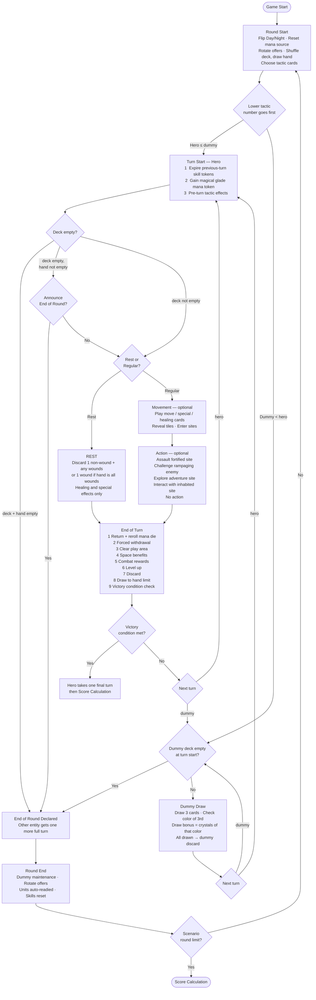

# Turn Structure LLD — Magus Warrior

## 1. Overview

This document specifies the complete turn structure for Magus Warrior: game start, round start preparation, hero and dummy player turns, end-of-turn cleanup, round end, and victory/end-game flow.

**Cross-references:**
- Movement rules within the hero's turn: `hex-movement-lld.md`
- Combat triggered during the hero's turn: `combat-flow-lld.md`
- Card effects played during a turn: `effect-lld.md`
- Site interactions taken as actions: `site-interaction-lld.md` (not yet written)

**Solo v1 scope:** One hero vs. one dummy player. Multiplayer round-order rules (multiple Round Order tokens, player-vs-player interactions) are noted where relevant but not implemented.

---

## 2. Data Model

### 2.1 TurnManager

`scripts/turn/TurnManager.cs` — pure C#, no Godot dependency.

```csharp
public class TurnManager {
    public TurnManager(
        GameState state,
        UIBroker broker,
        CombatResolver combat,
        EffectScheduler effects,
        DummyPlayerState dummy,
        IVictoryConditionEvaluator victoryEvaluator,
        IScoreCalculator scoreCalculator) { }

    public async Task RunGame();        // top-level game loop
    public async Task RunRound();       // one full round
    public async Task RunHeroTurn();    // one hero turn
    public void      RunDummyTurn();    // one dummy turn (no UI, no async)
}
```

### 2.2 TurnState

Per-turn flags. Reset at the start of each hero turn.

```csharp
public class TurnState {
    public bool           IsRest              { get; set; }
    public bool           CardsPlayedThisTurn { get; set; }
    public bool           ExtraTurnPending    { get; set; }  // The Right Moment
    public bool           EndOfRoundDeclared  { get; set; }
    public ManaSourceDie? UsedSourceDie       { get; set; }
}
```

### 2.3 DummyPlayerState

`scripts/turn/DummyPlayerState.cs`

```csharp
public class DummyPlayerState {
    public HeroType                   Hero     { get; init; }
    public Dictionary<ManaColor, int> Crystals { get; }
    public List<CardDefinition>       Deck     { get; private set; }
    public List<CardDefinition>       Discard  { get; private set; }

    public bool IsDeckEmpty => Deck.Count == 0;

    // Returns false if deck was empty at turn start → signals End of Round
    public bool TakeTurn();

    // Called at round end: adds newAA, adds crystal, shuffles new deck
    public void PrepareForNewRound(CardDefinition newAA, ManaColor crystalColor);
}
```

**Starting crystals by hero** (two of affinity color + one secondary):

| Hero | Crystal A | Crystal B | Crystal C |
|------|-----------|-----------|-----------|
| Arythea | Red | Red | White |
| Goldyx | Green | Green | Blue |
| Norowas | White | White | Green |
| Tovak | Blue | Blue | Red |

*Verify against physical hero cards — the bottom of each hero card shows the dummy player crystals.*

### 2.4 TacticCardDefinition

Tactic cards are data-driven from `data/cards.yaml`.

```csharp
public record TacticCardDefinition(
    string   Id,
    int      Number,              // 1–6; determines turn order
    DayNight Phase,               // Day or Night
    string?  OnTakeEffectId,      // fires at tactic selection (Rethink, Great Start, Preparation)
    string?  PersistentEffectId,  // fires each hero turn (Planning, Mana Search, Sparing Power)
    string?  OneTimeEffectId      // flips face-down after use (Right Moment, Long Night, Midnight Meditation)
);
```

### 2.5 ManaSource

`scripts/mana/ManaSource.cs` — one shared source per game.

```csharp
public class ManaSource {
    public IReadOnlyList<ManaSourceDie> Dice { get; }
    public bool IsDay { get; set; }

    // Round start: roll all dice; reroll gold+black until ≥ ceil(count/2) are basic
    public void ResetForRound();

    // Hero takes one die during their turn; returns its color as pure mana
    public Result<ManaColor> TakeDie(int dieIndex);

    // End-of-turn Step 1: reroll and return the taken die
    public void ReturnDie(ManaSourceDie die);
}
```

### 2.6 GamePhase Additions

Add to `scripts/core/types/GamePhase.cs`:

```csharp
public enum GamePhase {
    // ... existing combat phases ...
    TurnStart,
    Movement,
    ActionDeclaration,
    Rest,
    Interaction,
    EndOfTurn,
    RoundStart,
    RoundEnd,
    Any,
}
```

### 2.7 Victory and Score Interfaces

```csharp
public interface IVictoryConditionEvaluator {
    bool Check(GameState state);
}

public interface IScoreCalculator {
    int Calculate(GameState state);
}
```

---

## 3. Full Flow Diagram



---

## 4. Game Start

One-time setup before the first round. `TurnManager` delegates to an `IScenarioInitializer`.

Standard steps:
1. Select hero; place figure off-map (returns to portal at first turn start)
2. Shuffle hero's 16 Basic Action cards → Deed deck; draw to hand limit (5)
3. Place starting Level token face-up (Level 1–2 side, Armor 2, Hand 5)
4. Roll mana source dice; apply the basic-color rule (Section 5.2)
5. Put Day/Night board Day side up
6. Reveal starting tiles per scenario; check Site Description cards
7. Place initial rampaging enemies per scenario
8. **Skip "Prepare the Round" for round 1** — setup already handles it

---

## 5. Round Start

Runs at the start of every round after the first.

### 5.1 Sequence

1. **Flip Day/Night board** — Day → Night; Night → Day
2. **Reset mana source** — Section 5.2
3. **Create new Unit offer**
   - Return all current Unit cards to the bottom of their respective decks
   - Deal new Units equal to player count + 2 (solo = 3)
   - If no Core tile revealed: deal Regular (silver) only
   - Once at least one Core tile revealed: alternate Elite/Regular
4. **Monastery Advanced Action additions to Unit offer**
   - For each monastery on the map that has **not** been burned, draw 1 card from the AA deck and add it to the Unit offer
   - These cards are available for purchase as Advanced Actions at normal cost
   - If no unburned monasteries exist, skip this step
5. **Refresh Advanced Action offer**
   - Move the lowest-position card to the bottom of the AA deck
   - Shift remaining cards down one position
   - Draw a new card to the top position
6. **Refresh Spell offer** — same steps as AA offer
7. **Collect tactic cards** — return all previous-round tactic cards face-up to the display
8. **Each player:**
   - Flip all Banner Artifacts and Skill tokens face-up (ready)
   - Ready all Units (including Wounded — readied but still Wounded)
   - Shuffle all Deed cards (hand + discard + in play) into a new Deed deck
   - Draw cards up to Hand limit

### 5.2 Mana Source Reset Algorithm

```csharp
void ResetSource(bool isDay) {
    RollAllDice();
    while (BasicColorCount() < Math.Ceiling(Dice.Count / 2.0))
        RerollAllNonBasicDice(); // rerolls every gold AND black die
    IsDay = isDay;
}

bool IsBasicColor(ManaColor c) =>
    c is ManaColor.Red or ManaColor.Blue or ManaColor.Green or ManaColor.White;
```

After the loop:
- Gold dice: available as wildcard if **Day**; depleted at Night
- Black dice: available if **Night**; depleted during Day
- Depleted dice are placed in the top-right corner of the Source display

### 5.3 Tactic Card Selection

1. In solo, the hero always picks first; then the dummy player randomly draws one of the remaining tactic cards
2. Hero chooses one tactic card from the face-up display matching the current Day/Night phase
3. Follow any "when you take this tactic" instructions immediately (Section 14)
4. Rearrange Round Order tokens: lowest tactic number = top (goes first); highest = bottom
5. Set unused tactic cards aside for the round

---

## 6. Turn Order

Hero and dummy player alternate turns, starting with the holder of the lower-numbered tactic card. All tactic cards have unique numbers so ties cannot occur.

```
Example — Hero: Planning (Day #4), Dummy draws: Great Start (Day #5)
Turn order: Hero → Dummy → Hero → Dummy → ...
until End of Round is declared
```

---

## 7. Hero Turn — Start

Fires at the beginning of each hero turn before any cards are played or movement begins.

**Step 1 — Expire previous-turn skill tokens**

Skill tokens that persist "until start of your next turn" (hourglass icon) are flipped face-down now.

**Step 2 — Magical glade mana token**

If the hero is standing on a magical glade space, gain one mana token: **gold** during Day, **black** during Night. Place it in the play area; available this turn only.

**Step 3 — Pre-turn tactic effects**

Check active tactic cards for turn-start effects:
- **Sparing Power (Night #6):** mandatory choice — store the top Deed deck card face-down under the tactic, OR flip tactic face-down and take all stored cards into hand (Section 14)
- **Midnight Meditation (Night #4):** optional one-time use — may shuffle up to 5 cards back into deck and draw same count now, or save for a later turn start (Section 14)

**Step 4 — End of Round declaration check**

```
if deck.IsEmpty AND hand.IsEmpty  → must declare End of Round (Section 11)
else if deck.IsEmpty              → offer UIBroker choice: declare OR play normally
else                              → proceed to Turn Execution
```

---

## 8. Hero Turn — Execution

Set `TurnState.IsRest` at the rest/regular decision point.

### 8.1 Rest Turn

The hero cannot move, enter a site, take a combat action, or play Influence effects.

**Mandatory discard — choose one:**
- Hand has at least one non-Wound card: discard exactly one non-Wound + any number of Wounds
- Hand contains only Wound cards: discard exactly one Wound

**Allowed during rest:** healing effects (Heal X) and special effects (✦ on cards, units, or skills).

Space benefits at end of turn still apply on rest turns: the hero may throw away a Wound from hand or discard pile if on a magical glade, and gains a crystal if on a crystal mine.

### 8.2 Regular Turn

**Movement (optional)**

All rules from `hex-movement-lld.md` apply. During movement the hero may:
- Play card effects with Move, special ✦, or healing icons
- Reveal tiles (costs 2 Move points)
- Enter sites (site-entry rules apply immediately on entry)

Unused Move points are lost when the action phase begins, except where a specific effect states otherwise (e.g. Cumbersome enemy ability).

**Action (optional)**

After movement ends the hero may take one action:

| Action | Condition |
|--------|-----------|
| Assault fortified site | Hero moved into unconquered fortified space |
| Challenge rampaging enemy | Hero is adjacent to rampaging enemy |
| Explore adventure site | Hero is at adventure site and declares exploration |
| Interact with inhabited site | Hero is at village, conquered keep/tower, or monastery |
| No action | Hero ends turn without acting |

Special and healing effects (✦) may be played at any point during movement and action, including after combat resolves.

---

## 9. Hero Turn — End of Turn

Runs after Turn Execution completes. Steps are fixed and cannot be reordered.

**Step 1 — Return and reroll mana die**

If `TurnState.UsedSourceDie` is set: reroll that die and return it to the Source. The Source is now updated before the next entity's turn.

**Step 2 — Forced withdrawal**

If the hero is not on a safe space, backtrack through this turn's path to the nearest safe space visited, gaining one Wound per space backtracked. Full procedure: `hex-movement-lld.md` §9.

**Step 3 — Clear play area**

- Return all mana crystals (used or unused) from play area to the bank
- Move all played Deed cards to discard pile, with these exceptions:
  - Artifacts played for their strong effect (thrown away): return to bottom of Artifact deck
  - Wounds in the play area (placed there by hero skill effects): move to discard pile
  - Wounds in hand: return to Wound pile if discarded normally; Wounds in play area go to discard, not Wound pile

**Step 4 — Space benefits**

- **Magical glade:** may throw away one Wound card from hand or discard pile (return to Wound pile)
- **Crystal mine:** gain one crystal of the mine's color to Inventory (if already holding 3 of that color, gain nothing)

These apply on both rest turns and regular turns.

**Step 5 — Combat rewards**

Claim any combat rewards earned this turn in any order:
- **Crystals:** add to Inventory; if already 3 of that color, gain nothing; if reward is "random crystal," roll a die — black result = gain 1 Fame instead, gold result = choose any color
- **Artifacts:** draw (reward count + 1) from the Artifact deck; place one on top of Deed deck; place the remaining drawn Artifacts at the **bottom** of the Artifact deck
- **Spells / Advanced Actions:** choose one from the corresponding offer; place on top of Deed deck; replenish offer by shifting cards down and drawing a new card to the top slot
- **Units:** take any Unit from the Unit offer regardless of type; if no free Command token exists, must disband one existing Unit (exception: if leveling up this step grants a new Command token, disbanding may be deferred until after level-up)

**Step 6 — Level up**

If the hero's Fame token crossed one or more level thresholds this turn, for each level crossed:

- Remove the top Level token from the pile, revealing the new Armor value and Hand limit
- Flip the removed token to its Command token side and add it to the Unit area (Command limit +1)
- Gain one Skill token + one Advanced Action card from the offer:
  - Reveal the top two Skill tokens from the hero's pile
  - **Option A:** take one Skill token; place the other in the Common Skills area; take any one AA card from the offer
  - **Option B:** take one Skill token of another hero from the Common Skills area (if any); place both revealed tokens into Common Skills; take the AA card from the **lowest** offer position

*Solo v1 note: Option B requires another hero's token in the Common Skills area. Option A is the standard path.*

Hand limit increases from level-up take effect immediately and apply to Step 8 (draw) this same turn.

**Step 7 — Discard**

The hero may discard any number of non-Wound cards from hand before drawing.

**Mandatory case:** if the hero played zero cards this turn (no movement cards, no effects, no actions), they must discard at least one card. A rest turn satisfies this rule through its mandatory discard.

**Step 8 — Draw to hand limit**

Draw cards from the Deed deck up to the current Hand limit.

Hand limit modifiers:
- Base Hand limit shown on current Level token
- +1 if the hero **starts their turn** on or adjacent to one of their own conquered Keeps (marked with hero's Shield token); stacks if adjacent to multiple owned Keeps

If the hero already holds cards ≥ Hand limit, draw no cards (no mandatory discard to make room).

If the Deed deck runs out mid-draw, stop drawing without reshuffling — unless **Long Night (Night #2)** is active and unused (Section 11).

**Step 9 — Victory condition check**

Call `IVictoryConditionEvaluator.Check(gameState)`. If it returns `true`, set `GameState.FinalTurnTriggered = true`. The hero will take one more full turn before the game ends (Section 13).

---

## 10. Dummy Player Turn

`DummyPlayerState.TakeTurn()` — synchronous, no UI interaction.

```csharp
public bool TakeTurn() {
    if (IsDeckEmpty) return false; // signals End of Round

    var drawn = new List<CardDefinition>();
    for (int i = 0; i < 3 && Deck.Count > 0; i++)
        drawn.Add(PopTop());

    if (drawn.Count > 0) {
        var triggerColor = drawn[^1].Color; // color of 3rd card, or last drawn if < 3
        int bonus = Crystals.GetValueOrDefault(triggerColor, 0);
        for (int i = 0; i < bonus && Deck.Count > 0; i++)
            drawn.Add(PopTop());
    }

    Discard.AddRange(drawn);
    return true;
}
```

**Key rules:**
- End of Round check fires at **turn start only** — if the deck empties mid-draw, the dummy finishes the partial draw; End of Round does not trigger until the start of the dummy's next turn
- Drawn cards have no game effect; they simply deplete the deck (the dummy is a round clock)
- The dummy never uses mana, plays cards, moves, or interacts with sites
- The dummy's tactic card number affects turn order only; no tactic effects are applied for the dummy

---

## 11. End of Round Declaration

**Conditions:**

| Situation | Result |
|-----------|--------|
| Hero: deck empty AND hand empty | Hero **must** declare End of Round |
| Hero: deck empty, hand not empty | Hero **may** declare End of Round (UIBroker choice) |
| Dummy: deck empty at turn start | Dummy automatically declares End of Round |

**Long Night (Night #2) interaction:**

Before the hero declares (in either the forced or optional case), if Long Night is active and unused and a discard pile exists, the hero may activate it: shuffle the discard pile and place 3 cards at random back into the Deed deck, then flip Long Night face-down. The deck is no longer empty; the turn proceeds normally.

**After declaration:**

The declaring entity's turn ends immediately. In solo, if the dummy declared, the hero gets one final full turn. If the hero declared, no additional turns are taken. Then proceed to Round End.

---

## 12. Round End

Runs after the final turn following End of Round declaration.

### 12.1 Dummy Maintenance

```
1. Take the last Advanced Action card from the AA offer → add to dummy Discard
2. Note the color of the last Spell card in the Spell offer
3. Add one crystal of that color to dummy's hero card
4. Place that Spell card in the Spell offer discard pile (offer replenishes normally)
5. Shuffle dummy Discard (all drawn cards this round + new AA) → new dummy Deck
```

The dummy's deck grows by 1 card per round and gains 1 crystal per round, so later rounds tend to be shorter as the dummy draws more cards per turn.

### 12.2 Offer Rotation

The dummy maintenance step in 12.1 consumes the last card from the AA offer and displaces the last Spell card to its discard. The remaining cards in each offer shift down and a new card is drawn to the top slot. Unit offer is rebuilt entirely at next Round Start (Section 5.1 step 3).

### 12.3 Unit and Skill Reset

- All Units auto-ready (including Wounded Units — ready but still Wounded; require healing before activation)
- All Skill tokens flip face-up
- All Banner Artifacts flip face-up

### 12.4 Wounds in Hand

Wound cards in the hero's hand at round end are shuffled back into the Deed deck together with all other Deed cards at the start of the next round (Section 5.1 step 7).

---

## 13. Victory and End Game

### 13.1 Victory Condition Check

Called at End of Turn Step 9 after every hero turn. Scenario provides the implementation via constructor injection into `TurnManager`.

**First Recon:** returns `true` once a city tile has been revealed (`WorldMap.CityTileRevealed`).

### 13.2 Final Turn Sequence

When `IVictoryConditionEvaluator.Check()` returns `true`:
1. Set `GameState.FinalTurnTriggered = true`
2. Current turn completes its full End of Turn sequence (the triggering turn counts)
3. Hero receives one more complete turn (Turn Start → Execution → End of Turn)
4. After the final turn's End of Turn sequence completes → Score Calculation

Dummy player turns are not taken after victory is triggered.

### 13.3 Score Calculation

`IScoreCalculator.Calculate(gameState)` sums base Fame + achievement bonuses from the Achievement Scoring card. Scenario-specific bonus rules are defined in the Scenario LLD (not yet written). Result stored in `GameState.FinalScore`.

---

## 14. Tactic Cards

All tactic effects are implemented as `IEffect` hooks registered during `CardLoader.LoadAll()`. The dummy player's tactic number is used for turn-order sorting only — no effects are applied for the dummy.

### 14.1 Day Tactics

| # | Name | Effect Type | Effect |
|---|------|-------------|--------|
| 1 | Early Bird | Turn order only | No mechanical effect in solo v1. Guarantees hero goes first (tactic number 1 is always the lowest possible). |
| 2 | Rethink | On Take | After the initial hand is drawn at round start: discard up to 3 cards (including Wounds) from hand; draw the same number from the Deed deck; shuffle the discarded cards back into the Deed deck. |
| 3 | Mana Steal | Persistent (whole round) | Once per hero turn, the hero may take one **basic-color** die (not gold) from the Source, use it as pure mana, then reroll and return it at End of Turn Step 1. Follows the normal one-die-per-turn rule. |
| 4 | Planning | Persistent (each End of Turn) | At End of Turn Step 8: if the hero holds 2+ cards in hand before drawing, draw up to Hand limit + 1 this turn. |
| 5 | Great Start | On Take | Immediately draw 2 additional cards from the Deed deck into hand. |
| 6 | The Right Moment | One-time | Once this Day round: after the hero's current End of Turn sequence completes, the hero immediately takes an extra full turn before the dummy player's next turn. Flip face-down after use. |

### 14.2 Night Tactics

| # | Name | Effect Type | Effect |
|---|------|-------------|--------|
| 1 | From the Dusk | Turn order only | No mechanical effect in solo v1. Guarantees hero goes first (tactic number 1 is always the lowest possible). |
| 2 | Long Night | One-time | When the hero's Deed deck is empty (before declaring End of Round): shuffle the discard pile and place 3 cards at random back into the Deed deck; hero continues turn normally. Flip face-down after use. |
| 3 | Mana Search | Persistent (each turn) | Once per turn, before taking a die from the Source: may reroll up to 2 Source dice. Must select depleted dice (gold at Night, black during Day) before non-depleted dice if any depleted dice are present. |
| 4 | Midnight Meditation | One-time | At Turn Start Step 3, before any one of the hero's turns this Night round: shuffle up to 5 cards (including Wounds) from hand back into the Deed deck; draw the same number. Hero may save this for a later turn. Flip face-down after use. |
| 5 | Preparation | On Take | Immediately on tactic selection: search the Deed deck for any one card; put it in hand; shuffle the deck. |
| 6 | Sparing Power | Persistent (each turn start) | At Turn Start Step 3, before each hero turn: choose one — **Store:** draw the top Deed deck card and place it face-down under this tactic (not in play, not in the deck); OR **Cash in:** flip tactic face-down and take all stored cards into hand. Once cashed in the effect is over for the round. |

---

## Open Questions

None at time of writing.

## Resolved Questions

**Q: Do Early Bird and From the Dusk have any effect in solo v1?**
A: No mechanical effect. Their value is guaranteeing the hero goes first — tactic number 1 beats any number the dummy might draw.

**Q: When does the dummy's End of Round trigger if the deck empties mid-draw?**
A: At the start of the dummy's **next** turn. If the deck runs out during the draw the dummy completes the partial draw; End of Round fires at the next turn start.

**Q: Is the "must discard at least one card" rule satisfied by a rest turn?**
A: Yes. The rest turn's mandatory discard satisfies it.

**Q: Does the hero have to declare End of Round when their Deed deck is empty?**
A: Only if both deck AND hand are empty. Deck empty with cards still in hand is an optional declaration.

**Q: Do units ready at end of each turn?**
A: No. Units auto-ready at end of each **round** only.

**Q: Is there one shared mana source or per-player sources?**
A: One shared source for all players (solo or multiplayer).

**Q: Does Long Night let the hero avoid an otherwise forced End of Round?**
A: Yes, in both the forced case (deck + hand empty) and the optional case (deck empty, hand not empty), Long Night can be activated before the declaration, as long as a discard pile exists to shuffle from.

**Q: Does the hero pick tactic cards based on Fame order in solo?**
A: No. In solo the hero always picks first, then the dummy draws randomly from the remaining cards.

**Q: What color mana token does a magical glade provide?**
A: Gold during Day rounds, black during Night rounds.
